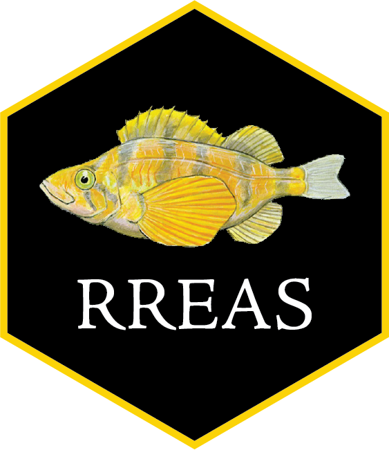

<!-- README.md is generated from README.Rmd. Please edit that file -->

```{r, include = FALSE}
knitr::opts_chunk$set(
  collapse = TRUE,
  comment = "#>",
  fig.path = "man/figures/README-",
  out.width = "100%"
)
```

# RREAS 

<!-- badges: start -->
<!-- badges: end -->

This package contains data and support functions for the NOAA SWFSC Rockfish Recruitment and Ecosystem Assessment Survey (RREAS). 

This is version `r packageVersion("RREAS")`. Please report any problems! 

A manuscript on the RREAS dataset is currently in preparation for the journal *Scientific Data*. This README will be updated with appropriate citation information once it is published and available. In the meantime:

An overview of methods, history, findings, and applications of the survey can be found [here](https://storymaps.arcgis.com/collections/af0fa37db2bf4f1cadb024ec0ffbdfb5).

To cite this dataset, please cite:  
Sakuma, K.M., Field, J.C., Mantua, N.J., Ralston, S., Marinovic, B.B. and Carrion, C.N. (2016) Anomalous epipelagic micronekton assemblage patterns in the neritic waters of the California Current in spring 2015 during a period of extreme ocean conditions. CalCOFI Rep. 57:163-183

To cite this software package, use `citation(package = "RREAS")`.

Juvenile cowcod illustration in our logo by Sophie Webb.  

## Installation

To install the latest version of the package:

``` r
install.packages("devtools") #if required
devtools::install_github("tanyalrogers/RREAS")
```
## Package overview

```{r}
library(RREAS)
```

The package allows for the loading of data from one of several sources into a common format that can be acted on by various support functions included in the package, or used for other analyses.

The package contains a current copy of the RREAS data posted on Dryad (LINK WILL GO HERE ONCE ACTIVE). The data do not have to be separately downloaded. The data currently span `r min(HAULSTANDARD_RREAS$YEAR)` to `r max(HAULSTANDARD_RREAS$YEAR)`. The trawl-associated data (`HAUL`, `CATCH`, `LENGTH`, `WEIGHT`, `STATIONS`, `SPECIES_CODES`, and derived table `HAULSTANDARD`) can be loaded using `load_trawls()`. The other tables (`CTD_HEADER`, `CTD_CAST`, `NET_MENSURATION`) can be called directly for lazy loading.

The package also contains a copy of the trawl-associated data (`HAUL`, `CATCH`, `LENGTH`) posted on [ERDDAP](https://oceanview.pfeg.noaa.gov/erddap/index.html), which contain only a subset of the data posted on Dryad. The ERDDAP dataset contains data from `r min(HAULSTANDARD_ERDDAP$YEAR)` to `r max(HAULSTANDARD_ERDDAP$YEAR)` and for standard, active stations only. The trawl-associated data can be loaded using `load_erddap()`. Note that the `WEIGHT` table is not included in this dataset, and there are some differences in how the krill and young-of-the-year rockfish are coded. The catch table on ERDDAP is reformatted into relational `HAUL` and `CATCH` tables to match the format of the other data sources. The `SPECIES_CODES` and `STATIONS` tables that are loaded come from Dryad dataset.

For internal users at NOAA, there are functions to load data from a local copy of the RREAS MS Access Database, which also contains the NWFSC, PWCC, and ADAMS datasets, as well as the `AGE` table for age-at-length regressions. Abundance indices for stock assessments and other ecosystem reports can thus be produced. The trawl-associated data can be loaded using `load_mdb()`.

Metadata for all data tables can be found under `help(RREAS)`.

## Loading trawl data

To load the trawl-associated data, simply run: 

```{r}
load_trawls()
```

The data tables will be loaded to your global environment:
```{r}
ls(name = .GlobalEnv) #list objects in your workspace
```

The `load_trawls()` function also creates a HAULSTANDARD table containing only standard stations (STANDARD_STATION=1) and with a reduced, standardized set of columns including YEAR, MONTH, JDAY, and lat/lon in decimal degrees. The support functions described below pull data for the hauls listed in HAULSTANDARD (unless otherwise specified). By default, HAULSTANDARD contains only hauls from active stations (omitting inactive stations) and from the standard survey time period (omitting early surveys, CRUISE 8703, 8804, and 9003). If you would like to include the inactive stations in HAULSTANDARD, set `activestationsonly=FALSE` in `load_trawls()`. If you would like to include the early surveys in HAULSTANDARD, set `stdtimeperiodonly=FALSE` in `load_trawls()`. A `startyear` can also be specified (defaults to 1983). Subsetting HAULSTANDARD after loading is also an acceptable approach.

The ERDDAP data can be loaded in the same way using `load_erddap()`. This dataset does not include data from the inactive stations or the early suveys. 

Note that using any of the `load` functions will overwrite whatever tables currently exist in your global environment. 

## Extracting data for species

There are two main data extraction functions: `get_totals` and `get_distributions`. The function `get_totals` can be used to obtain total haul-level abundance or (for select species) biomass. The function `get_distributions` can be used to obtain size or (for select species) mass distribution data.

### Formatting the species table

Both functions require a specially formatted data frame (the `speciestable`) as an input. This table specifies which species to extract (multiple species can be specified), whether/how to aggregate them, and whether any length constraints should be imposed. Data from multiple species and species groupings can be extracted in one function call, or they can be extracted separately and appended.

The species table must have the following columns:  
- SPECIES: Species codes  
- MATURITY: Maturity codes  
- NAME: A custom name, typically the common name. Rows with the same NAME value will be aggregated together.  

The table may optionally include:  
- MINLEN: The minimum length in mm, greater than or equal to (if column is missing or value is NA, defaults to 0)  
- MAXLEN: The maximum length in mm, less than (if column is missing or value is NA, defaults to Inf)  

Here's an example of of how you might construct a table for YOY Anchovy, Adult Anchovy, and Total Anchovy:

```{r}
anchtable <- data.frame(SPECIES=209, MATURITY=c("Y","A","Y","A"),
                        NAME=c("YOY Anchovy", "Adult Anchovy", "Total Anchovy", "Total Anchovy"))
anchtable
```

If you wanted to split adult Anchovy into two size classes, here's how you might do that:

```{r}
anchtable_len <- data.frame(SPECIES=209, MATURITY="A",
                            NAME=c("Small adult anchovy", "Large adult anchovy"),
                            MINLEN=c(90,120),
                            MAXLEN=c(120,NA))
anchtable_len
```

The package contains some pre-made species tables with common species and species groupings, which can be subsetted if desired. You can explicitly load them using `data()`, or call them directly. You can also construct your own custom species table as in the above examples.

```{r}
#Some common species and species groups used in ecosystem reports.
data("sptable")
unique(sptable$NAME) #available species and species groups
head(sptable)
```

```{r}
#Species for which length-weight regressions exist, and for which biomass can be obtained.
data("sptable_lw")
unique(sptable_lw$NAME) #available species and species groups
```

### Getting totals

The function `get_totals` has 5 inputs:  
- `speciestable`: The species table data frame   
- `what`: What kind of total you want, either `"abundance"` or `"biomass"`. Defaults to `"abundance"`.  
- `startyear`: Start year (optional). Defaults to 1983.  
- `haultable`: Table of hauls to from which to obtain totals. Defaults to `HAULSTANDARD`.  
- `datasets`: Relevant only for internal users loading multiple datasets from the MS Access Database. Defaults to RREAS only.  

Values will be generated for each unique NAME in `speciestable` for each haul in HAULSTANDARD (unless another table is specified under `haultable`). If multiple NAME values are present, the results will be stacked in long format. 

If a station was sampled, but the requested species was *not counted* at the time, it will appear as an NA. If the species was counted but was *not present*, it will appear as 0. If the species was counted but the counts numbers are unreliable (the case for some species prior to 1990, presence/absence will still be reliable), a message will be displayed. Description of additional irregularities in species classification can be found in the `sptable` documentation and in the SPECIES_CODES table. **It your responsibility to know when your focal species were or were not being recorded.**

Biomass is only available for species with length-weight regressions. The table `sptable_lw` lists the species for which length-weight regressions are avaiable. See `help(get_lw_regression)` for more info on how the regressions are done. (The function `get_lw_regression` is used internally, but can be run independently if desired.)

If you ask for `"biomass"`, the output will also include TOTAL_NO (abundance) and NMEAS (number of fish measured). If you include length constraints, the output table will include additional columns NMEAS_SIZE (number measured in the size range) and NSIZE (total number in the size range, which is probably what you want, not TOTAL_NO). 

Examples:

```{r totals}
#YOY, Adult, Total anchovy abundances
anchabund <- get_totals(anchtable, what = "abundance")
head(anchabund)

#Biomass for different anchovy size classes
anchbiomass_len <- get_totals(anchtable_len, what = "biomass")
tail(anchbiomass_len)

#Total YOY rockfish
yoyrockfish <- subset(sptable, NAME=="YOY Rockfish")
yoyrockfishabund <- get_totals(yoyrockfish, what = "abundance")
head(yoyrockfishabund)
```

### Getting distributions

The function `get_distributions` has the same 5 inputs, except `what` should be either `"size"` or `"mass"`. As with `get_totals`, lenght-weight regressions must exist in order to obtain mass distributions.

If a haul had no fish, it will appear in the output dataset (with TOTAL_NO=0). If a haul had fish, but no fish were measured, there will be a TOTAL_NO>0, NMEAS will be 0, and there will be a single length/mass entry for that haul, which will be the average values used as a substitute.

The output table will include TOTAL_NO, NMEAS (number measured), EXP (expansion factor), SP_NO (specimen number) and values for the requested distribution. If `"size"` is requested, it will include column STD_LENGTH. If `"mass"` is requested, it will include columns STD_LENGTH and WEIGHT. If size limits are specified, it will include additional columns NMEAS_SIZE (number measured in the size range), PSIZE (proportion of measured fish in the size range), and NSIZE (total number in the size range, which is probably what you want, not TOTAL_NO).

```{r distributions}
#Size distribution for anchovy
anchsizedist <- get_distributions(anchtable, what = "size")
head(anchsizedist)

#Mass distribution for different anchovy size classes
anchmassdist <- get_distributions(anchtable_len, what = "mass")
tail(anchmassdist)
```

Note that if you are combining distributions across tows, they will need to be weighted by the total number of individuals caught. This is most easily done by binning the lengths and summing the expansion factors. 

```{r combdist, warning=FALSE, message=FALSE}
library(ggplot2)
library(dplyr)

binwidth <- 6
breaks <- seq(min(anchsizedist$STD_LENGTH, na.rm = T),
           max(anchsizedist$STD_LENGTH, na.rm = T), by = binwidth)

anchsizedist$bin=cut(anchsizedist$STD_LENGTH, breaks, labels = breaks[-1]-binwidth/2)

anchsizedist_sum=anchsizedist %>% 
  filter(NAME %in% c("Adult Anchovy", "YOY Anchovy")) %>% 
  filter(YEAR %in% c(2024,2025)) %>% #for a simpler figure
  filter(!is.na(EXP)) %>% #remove hauls with no fish caught
  group_by(NAME, YEAR, bin) %>% 
  summarise(total=sum(EXP, na.rm=T)) %>% 
  group_by(NAME, YEAR) %>% 
  mutate(Proportion=total/sum(total))

ggplot(anchsizedist_sum, aes(x=as.numeric(as.character(bin)), y=Proportion)) +
  facet_grid(NAME~YEAR, scale="free_y") +
  geom_col(width = binwidth, color="black") + theme_bw() +
  scale_y_continuous(expand = expansion(mult = c(0,0.05))) +
  scale_x_continuous(expand = c(0,0)) +
  labs(x="Length (mm)")
```

## Generating indices

Given an output table from `get_totals`, there is a function `get_logcpueindex` which will compute `mean(log(x+1))` for an `x` of your choice, for each YEAR and NAME. It allows optional grouping variables (typically STRATA). A standardized index (within groups) is also computed by default, but can be turned off by setting `standardized=FALSE`.

```{r indices, warning=FALSE, message=FALSE}
library(ggplot2)
library(dplyr)

anchindex1 <- get_logcpueindex(anchabund, var = "TOTAL_NO", group="STRATA")
head(anchindex1)

anchindex1plot <- anchindex1 %>% 
  #filter(!(YEAR<2004 & STRATA!="C")) %>% #exclude non-core areas before 2004
  mutate(STRATA=factor(STRATA, levels = c("N","NC","C","SC","S")))
ggplot(anchindex1plot,aes(y=TOTAL_NO_INDEX,x=YEAR)) +
  facet_grid(STRATA~NAME) +
  geom_point() + geom_line() +
  theme_bw() +
  labs(x="Year", y="log Abundance")

anchindex2 <- get_logcpueindex(anchbiomass_len, var = "BIOMASS", group="STRATA")
head(anchindex2)

anchindex2plot <- anchindex2 %>% 
  #filter(!(YEAR<2004 & STRATA!="C")) %>% #exclude non-core areas before 2004
  mutate(STRATA=factor(STRATA, levels = c("N","NC","C","SC","S")))
ggplot(anchindex2plot,aes(y=BIOMASS_INDEX,x=YEAR)) +
  facet_grid(STRATA~NAME) +
  geom_point() + geom_line() +
  theme_bw() +
  labs(x="Year", y="log Biomass")
```

## Depth-stratified tows

RREAS standard tows are conducted at 30 m headrope depth (DEPTH_STRATA 2), with the exception of stations with a bottom depth of less than 60 m, which are towed at 10 m headrope depth (DEPTH_STRATA 1). These are the tows which appear in HAULSTANDARD.

Historically, mostly before the coastwide expansion in 2004, multiple depth strata (DEPTH_STRATA 1: 10 m, DEPTH_STRATA 2: 30 m, DEPTH_STRATA 3: 90 m) were sampled in succession at specific stations, mostly at stations 110, 125, 133, and 170, but occassionally others. The function `load_depth_stratified_tows` pulls out these depth-stratified tows into the table HAULDEPTHSTRATIFED. It has the same format as HAULSTANDARD, but with a few extra columns: DEPTH_STRATA, SWEEP (indicates which of the 3 passes the sampling is from; there is generally one set of depth-stratified tows per sweep, but not always), and SWEEP_SEP (separates cases in which there are multiple sets of depth stratified tows per sweep, and sets of depth stratified tows where SWEEP in NA, which occurs after 2004; otherwise equal to SWEEP). Each set of consecutive depth stratified tows will have a unique CRUISE/STATION/SWEEP_SEP value.

HAULDEPTHSTRATIFED can be passed to `get_totals` or `get_distributions` to get catch data from these hauls instead of HAULSTANDARD by supplying it under `haultable`. Note that all of the depth-stratified tows are not present in the ERDDAP dataset.

Note that to get *all* of the depth-stratified tows, you have to include the non-active stations (`activestationsonly = FALSE`).

```{r}
load_trawls(activestationsonly = FALSE)
load_depth_stratified_tows()
str(HAULDEPTHSTRATIFIED)

anchabund_ds <- get_totals(anchtable, what = "abundance", haultable = HAULDEPTHSTRATIFIED)

#to get depth stratified tows with all 3 strata sampled
HAULDEPTHSTRATIFIED <- HAULDEPTHSTRATIFIED %>% 
  group_by(CRUISE,STATION,SWEEP_SEP) %>%
  mutate(ustrata=length(unique(DEPTH_STRATA)))
filter(HAULDEPTHSTRATIFIED, ustrata==3) %>% nrow()
filter(HAULDEPTHSTRATIFIED, ustrata==3 & YEAR>=1990) %>% nrow()

#see which tows have CTDs
HAULDEPTHSTRATIFIED <- HAULDEPTHSTRATIFIED %>%
  left_join(HAUL %>% select(CRUISE, HAUL_NO, CTD_INDEX), by = c("CRUISE", "HAUL_NO"))
```

## Internal users

The function `load_mdb` loads data from a local copy of the RREAS MS Access Database. It has the same arguments and defaults as `load_trawls` plus an additional `datasets` argument that can be used to load the additional datasets: NWFSC, PWCC, and ADAMS. The default behavior of `load_mdb` is to load just the RREAS data (`datasets = "RREAS"`). The AGE table will also be loaded.

To use `load_mdb`, you will need to specify the file path to the local MS Access Database.

```{r dataload}
#replace the file paths with those for your machine
#any previously loaded tables with the same name in your workspace will be overwritten
rm(list = ls())
load_mdb(mdb_path="C:/Rogers/Documents/Rockfish/RREAS/Survey data/juv_cruise_backup22APR26.mdb",
         krill_len_path="C:/Rogers/Documents/Rockfish/Index generation/length weight/krill_lengths.csv")
ls(name = .GlobalEnv) #list objects in your workspace
```

Currently, the krill lengths are not in the database, so must be supplied as a separate file. This file is *not necessary* however, unless you want to get krill biomass or length distributions. Just omit this argument if you don't have the file.

As before, if you would like to include the inactive stations in HAULSTANDARD, set `activestationsonly=FALSE`. If you would like to include the early surveys in HAULSTANDARD, set `stdtimeperiodonly=FALSE`.

To load data from multiple datasets, specify which ones under `datasets`.

```{r dataload2}
#replace the file paths with those for your machine
load_mdb(mdb_path="C:/Rogers/Documents/Rockfish/RREAS/Survey data/juv_cruise_backup22APR26.mdb",
         krill_len_path="C:/Users/trogers/Documents/Rockfish/Index generation/length weight/krill_lengths.csv",
         datasets = c("RREAS","ADAMS","PWCC","NWFSC"),
         activestationsonly = TRUE)
ls(name = .GlobalEnv) #list objects in your workspace
```

There is another, optional argument to load `atsea.mdb` and append the current year's data if it is not in the primary database. See `help(load_mdb)` for more information.

The data extraction functions `get_totals` and `get_distributions` are used in the same way as decribed above, but you can specify which `datasets` to pull data from (if they have been loaded). Only one table is outputted, so if you request data from multiple datasets, they results will be combined (column SURVEY differentiates source). 

```{r}
#Anchovy from RREAS and NWFSC surveys
anchtabletotal <- data.frame(SPECIES=209, MATURITY=c("Y","A"),
                        NAME=c("Total Anchovy", "Total Anchovy"))
anchabund <- get_totals(anchtabletotal, datasets = c("RREAS","NWFSC"), what = "abundance")
table(anchabund$SURVEY)
```

In addition, `get_totals` can be used to obtain total haul-level 100-day standardized abundance (`what = "100day"`), and `get_distributions` can be used to obtain age distribution data (`what = "age"`).

100-day standardized abundance and age distribution are only available for species with length-age regressions. This includes the rockfish species listed in `sptable_rockfish100`, hake (382), and lingcod (448). See `help(get_la_regression)` and `help(age_to_100day)` for more details on how the regressions are done. (These functions are also used internally, but can be run independently if desired.)

```{r}
#Rockfish species used in the 100 day standardized abundance index
data("sptable_rockfish100")
sptable_rockfish100

#100 day standardized rockfish abundance
rockfish100equiv <- get_totals(sptable_rockfish100, what = "100day")
tail(rockfish100equiv)

#generate index
rockfish100index <- get_logcpueindex(rockfish100equiv, var="N100", group="STRATA")
head(rockfish100index)

rf100plot <- rockfish100index %>% 
  filter(STRATA=="C" & NAME!="mel" & NAME!="lev") %>% 
  left_join(sptable_rockfish100, by = "NAME")
ggplot(rf100plot,aes(y=N100_INDEX_SC,x=YEAR, group=COMMON, color=COMMON)) +
  geom_point() + geom_line() +
  theme_bw() +
  labs(x="Year", y="log 100-day standardized abundance", color="Rockfish species")
```

If "age" is requested in `get_distributions`, the output will include columns STD_LENGTH, AGE, N100i (number of 100 day equivalents), and JDAY_DOB (date of birth).

```{r}
#rockfish age distributions
rockfish100agedist <- get_distributions(sptable_rockfish100, what = "age")
tail(rockfish100agedist)
```
