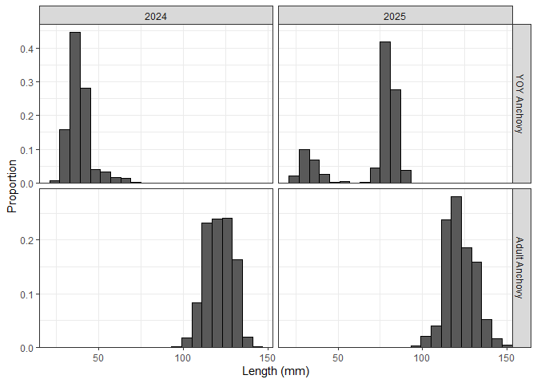
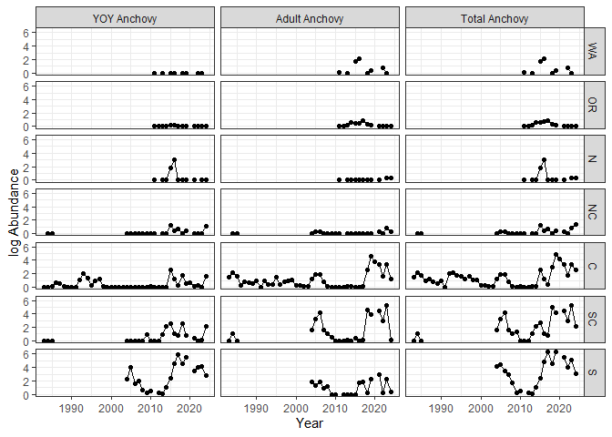
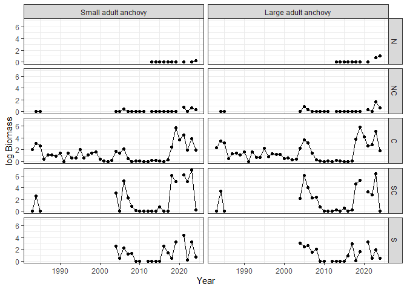
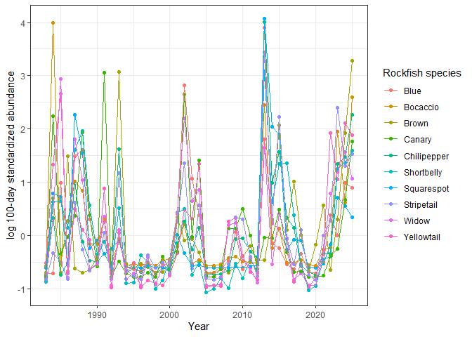

<!-- README.md is generated from README.Rmd. Please edit that file -->

# RREAS 

<!-- badges: start -->
<!-- badges: end -->

This package contains data and support functions for the NOAA SWFSC
Rockfish Recruitment and Ecosystem Assessment Survey (RREAS).

This is version 0.2.0. Please report any problems!

A manuscript on the RREAS dataset is currently in preparation for the
journal *Scientific Data*. This README will be updated with appropriate
citation information once it is published and available. In the
meantime:

An overview of methods, history, findings, and applications of the
survey can be found
[here](https://storymaps.arcgis.com/collections/af0fa37db2bf4f1cadb024ec0ffbdfb5).

To cite this dataset, please cite:  
Sakuma, K.M., Field, J.C., Mantua, N.J., Ralston, S., Marinovic, B.B.
and Carrion, C.N. (2016) Anomalous epipelagic micronekton assemblage
patterns in the neritic waters of the California Current in spring 2015
during a period of extreme ocean conditions. CalCOFI Rep. 57:163-183

To cite this software package, use `citation(package = "RREAS")`.

Juvenile cowcod illustration in our logo by Sophie Webb.

## Installation

To install the latest version of the package:

``` r
#install.packages("devtools") #if required
devtools::install_github("tanyalrogers/RREAS")
```

## Package overview

``` r
library(RREAS)
```

The package allows for the loading of data from one of several sources
into a common format that can be acted on by various support functions
included in the package, or used for other analyses.

The package contains a current copy of the RREAS data posted on Dryad
(LINK WILL GO HERE ONCE ACTIVE). The data do not have to be separately
downloaded. The data currently span 1983 to 2025. The trawl-associated
data (`HAUL`, `CATCH`, `LENGTH`, `WEIGHT`, `STATIONS`, `SPECIES_CODES`,
and derived table `HAULSTANDARD`) can be loaded using `load_trawls()`.
The other tables (`CTD_HEADER`, `CTD_CAST`, `NET_MENSURATION`) can be
called directly for lazy loading.

The package also contains a copy of the trawl-associated data (`HAUL`,
`CATCH`, `LENGTH`) posted on
[ERDDAP](https://oceanview.pfeg.noaa.gov/erddap/index.html), which
contain only a subset of the data posted on Dryad. The ERDDAP dataset
contains data from 1990 to 2025 and for standard, active stations only.
The trawl-associated data can be loaded using `load_erddap()`. Note that
the `WEIGHT` table is not included in this dataset, and there are some
differences in how the krill and young-of-the-year rockfish are coded.
The catch table on ERDDAP is reformatted into relational `HAUL` and
`CATCH` tables to match the format of the other data sources. The
`SPECIES_CODES` and `STATIONS` tables that are loaded come from Dryad
dataset.

For internal users at NOAA, there are functions to load data from a
local copy of the RREAS MS Access Database, which also contains the
NWFSC, PWCC, and ADAMS datasets, as well as the `AGE` table for
age-at-length regressions. Abundance indices for stock assessments and
other ecosystem reports can thus be produced. The trawl-associated data
can be loaded using `load_mdb()`.

Metadata for all data tables can be found under `help("RREAS_TABLES")`.

## Loading trawl data

To load the trawl-associated data, simply run:

``` r
load_trawls()
#> Data loaded.
```

The data tables will be loaded to your global environment:

``` r
ls(name = .GlobalEnv) #list objects in your workspace
#> [1] "CATCH"         "HAUL"          "HAULSTANDARD"  "LENGTH"       
#> [5] "SPECIES_CODES" "STATIONS"      "WEIGHT"
```

In addition to loading the main tables, `load_trawls()` also creates a
HAULSTANDARD table containing only standard stations
(STANDARD_STATION=1) and with a reduced, standardized set of columns
including YEAR, MONTH, JDAY, and lat/lon in decimal degrees. The support
functions described below pull data for the hauls listed in HAULSTANDARD
(unless otherwise specified). By default, HAULSTANDARD contains only
hauls from active stations (omitting inactive stations) and from the
standard survey time period (omitting early surveys, CRUISE 8703, 8804,
and 9003). If you would like to include the inactive stations in
HAULSTANDARD, set `activestationsonly=FALSE` in `load_trawls()`. If you
would like to include the early surveys in HAULSTANDARD, set
`stdtimeperiodonly=FALSE` in `load_trawls()`. A `startyear` can also be
specified (defaults to 1983). Subsetting HAULSTANDARD after loading is
also an acceptable approach.

The ERDDAP data can be loaded in the same way using `load_erddap()`.
This function has no arguments (the dataset does not include data from
the inactive stations or the early suveys).

Note that using any of the `load_xxx()` functions will overwrite
whatever tables currently exist in your global environment.

## Extracting data for species

There are two main data extraction functions: `get_totals` and
`get_distributions`. The function `get_totals` can be used to obtain
total haul-level abundance or biomass. The function `get_distributions`
can be used to obtain size or mass distribution data. Biomass and mass
distribution data are only available for select species.

### Formatting the species table

Both functions require a specially formatted data frame (the
`speciestable`) as an input. This table specifies which species to
extract (multiple species can be specified), whether/how to aggregate
them, and whether any length constraints should be imposed. Data from
multiple species and species groupings can be extracted in one function
call, or they can be extracted separately and appended.

The species table must have the following columns:  
- SPECIES: Species codes  
- MATURITY: Maturity codes  
- NAME: A custom name, typically the common name. Rows with the same
NAME value will be aggregated together.

The table may optionally include:  
- MINLEN: The minimum length in mm, greater than or equal to (if column
is missing or value is NA, defaults to 0)  
- MAXLEN: The maximum length in mm, less than (if column is missing or
value is NA, defaults to Inf)

Here’s an example of of how you might construct a table for YOY Anchovy,
Adult Anchovy, and Total Anchovy:

``` r
anchtable <- data.frame(SPECIES=209, MATURITY=c("Y","A","Y","A"),
                        NAME=c("YOY Anchovy", "Adult Anchovy", "Total Anchovy", "Total Anchovy"))
anchtable
#>   SPECIES MATURITY          NAME
#> 1     209        Y   YOY Anchovy
#> 2     209        A Adult Anchovy
#> 3     209        Y Total Anchovy
#> 4     209        A Total Anchovy
```

If you wanted to split adult Anchovy into two size classes, here’s how
you might do that:

``` r
anchtable_len <- data.frame(SPECIES=209, MATURITY="A",
                            NAME=c("Small adult anchovy", "Large adult anchovy"),
                            MINLEN=c(90,120),
                            MAXLEN=c(120,NA))
anchtable_len
#>   SPECIES MATURITY                NAME MINLEN MAXLEN
#> 1     209        A Small adult anchovy     90    120
#> 2     209        A Large adult anchovy    120     NA
```

The package contains some pre-made species tables with common species
and species groupings, which can be subsetted if desired. You can
explicitly load them using `data()`, or call them directly. You can also
construct your own custom species table as in the above examples.

``` r
#Some common species and species groups used in ecosystem reports.
data("sptable")
unique(sptable$NAME) #available species and species groups
#>  [1] "YOY Rockfish"     "Market Squid"     "YOY Pacific Hake" "Adult Anchovy"   
#>  [5] "YOY Anchovy"      "Adult Sardine"    "YOY Sardine"      "Pyrosomes"       
#>  [9] "Thetys"           "Salps"            "YOY Sanddabs"     "Total Myctophids"
#> [13] "Octopus"          "Total Krill"
head(sptable)
#>   SPECIES MATURITY         NAME
#> 1     580        Y YOY Rockfish
#> 2     582        Y YOY Rockfish
#> 3     583        Y YOY Rockfish
#> 4     584        Y YOY Rockfish
#> 5     592        Y YOY Rockfish
#> 6     593        Y YOY Rockfish
```

``` r
#Species for which length-weight regressions exist, and for which biomass can be obtained.
data("sptable_lw")
unique(sptable_lw$NAME) #available species and species groups
#>  [1] "YOY Rockfish"             "Blacksmelt"              
#>  [3] "Adult Pacific sanddab"    "YOY Pacific sanddab"     
#>  [5] "YOY Speckled sanddab"     "YOY Sanddabs"            
#>  [7] "YOY Anchovy"              "Adult Anchovy"           
#>  [9] "Total Anchovy"            "Goby"                    
#> [11] "California Smoothtongue"  "YOY Pacific Hake"        
#> [13] "YOY Lingcod"              "YOY Sardine"             
#> [15] "Adult Sardine"            "Total Sardine"           
#> [17] "Market Squid"             "Sea nettle"              
#> [19] "Octopus"                  "Pyrosome"                
#> [21] "Armhook squid"            "Thetys salp"             
#> [23] "Blacktip squid"           "Moon jelly"              
#> [25] "Boreal clubhook squid"    "Blue lanternfish"        
#> [27] "California headlightfish" "California lanternfish"  
#> [29] "Nannobrachium spp."       "Mexican lampfish"        
#> [31] "Northern lampfish"        "Total Myctophids"        
#> [33] "Total Krill"              "Carinaria"               
#> [35] "Medusafish"               "King-of-the-salmon"
```

### Getting totals

The function `get_totals` has 5 inputs:  
- `speciestable`: The species table data frame  
- `what`: What kind of total you want, either `"abundance"` or
`"biomass"`. Defaults to `"abundance"`.  
- `startyear`: Start year (optional). Defaults to 1983.  
- `haultable`: Table of hauls to from which to obtain totals. Defaults
to `HAULSTANDARD`.  
- `datasets`: Relevant only for internal users loading multiple datasets
from the MS Access Database. Defaults to RREAS only.

Values will be generated for each unique NAME in `speciestable` for each
haul in HAULSTANDARD (unless another table is specified under
`haultable`). If multiple NAME values are present, the results will be
stacked in long format.

If a station was sampled, but the requested species was *not counted* at
the time, it will appear as an NA. If the species was counted but was
*not present*, it will appear as 0. If the species was counted but the
counts numbers are unreliable (the case for some species prior to 1990,
presence/absence will still be reliable), a message will be displayed.
Description of additional irregularities in species classification can
be found in the `sptable` documentation and in the SPECIES_CODES table.
**It your responsibility to know when your focal species were or were
not being recorded.**

Biomass is only available for species with length-weight regressions.
The table `sptable_lw` lists the species for which length-weight
regressions are avaiable. See `help(get_lw_regression)` for more info on
how the regressions are done. (The function `get_lw_regression` is used
internally, but can be run independently if desired.)

If you ask for `"biomass"`, the output table will also include TOTAL_NO
(abundance) and NMEAS (number of fish measured).

If you include length constraints, the output table will include
additional columns NMEAS (number of fish measured), NMEAS_SIZE (number
measured in the size range), and NSIZE (total number in the size range,
which is probably what you want for abundance, not TOTAL_NO).

Examples:

``` r
#YOY, Adult, Total anchovy abundances
anchabund <- get_totals(anchtable, what = "abundance")
head(anchabund)
#>   SURVEY CRUISE HAUL_NO YEAR MONTH JDAY  HAUL_DATE STATION NET_IN_LATDD
#> 1  RREAS   8303       7 1983     6  161 1983-06-10     104           NA
#> 2  RREAS   8303      15 1983     6  163 1983-06-12     119           NA
#> 3  RREAS   8303      17 1983     6  164 1983-06-13     114           NA
#> 4  RREAS   8303      18 1983     6  164 1983-06-13     116           NA
#> 5  RREAS   8303      24 1983     6  165 1983-06-14     117           NA
#> 6  RREAS   8303      25 1983     6  165 1983-06-14     113           NA
#>   NET_IN_LONDD    LATDD     LONDD BOTTOM_DEPTH STATION_BOTTOM_DEPTH STRATA
#> 1           NA 36.30000 -122.0900          438                  354     SC
#> 2           NA 36.84667 -121.9833           80                   91      C
#> 3           NA 36.76667 -121.8667           82                   73      C
#> 4           NA 36.74000 -121.9767          444                  287      C
#> 5           NA 36.70000 -122.1083         1828                 1920      C
#> 6           NA 36.64667 -122.0500         1097                  900      C
#>                   AREA ACTIVE          NAME TOTAL_NO
#> 1            Point Sur      Y Adult Anchovy        0
#> 2  Monterey Bay Inside      Y Adult Anchovy      268
#> 3  Monterey Bay Inside      Y Adult Anchovy       40
#> 4  Monterey Bay Inside      Y Adult Anchovy       14
#> 5 Monterey Bay Outside      Y Adult Anchovy        0
#> 6 Monterey Bay Outside      Y Adult Anchovy        0

#Biomass for different anchovy size classes
anchbiomass_len <- get_totals(anchtable_len, what = "biomass")
head(anchbiomass_len)
#>   SURVEY CRUISE HAUL_NO YEAR MONTH JDAY  HAUL_DATE STATION NET_IN_LATDD
#> 1  RREAS   8303       7 1983     6  161 1983-06-10     104           NA
#> 2  RREAS   8303      15 1983     6  163 1983-06-12     119           NA
#> 3  RREAS   8303      17 1983     6  164 1983-06-13     114           NA
#> 4  RREAS   8303      18 1983     6  164 1983-06-13     116           NA
#> 5  RREAS   8303      24 1983     6  165 1983-06-14     117           NA
#> 6  RREAS   8303      25 1983     6  165 1983-06-14     113           NA
#>   NET_IN_LONDD    LATDD     LONDD BOTTOM_DEPTH STATION_BOTTOM_DEPTH STRATA
#> 1           NA 36.30000 -122.0900          438                  354     SC
#> 2           NA 36.84667 -121.9833           80                   91      C
#> 3           NA 36.76667 -121.8667           82                   73      C
#> 4           NA 36.74000 -121.9767          444                  287      C
#> 5           NA 36.70000 -122.1083         1828                 1920      C
#> 6           NA 36.64667 -122.0500         1097                  900      C
#>                   AREA ACTIVE                NAME TOTAL_NO NMEAS NMEAS_SIZE
#> 1            Point Sur      Y Large adult anchovy        0     0          0
#> 2  Monterey Bay Inside      Y Large adult anchovy      268     0          0
#> 3  Monterey Bay Inside      Y Large adult anchovy       40     0          0
#> 4  Monterey Bay Inside      Y Large adult anchovy       14     0          0
#> 5 Monterey Bay Outside      Y Large adult anchovy        0     0          0
#> 6 Monterey Bay Outside      Y Large adult anchovy        0     0          0
#>        NSIZE   BIOMASS
#> 1   0.000000    0.0000
#> 2 147.678631 3741.2328
#> 3  22.041587  558.3930
#> 4   7.714555  195.4375
#> 5   0.000000    0.0000
#> 6   0.000000    0.0000

#Total YOY rockfish
yoyrockfish <- subset(sptable, NAME=="YOY Rockfish")
yoyrockfishabund <- get_totals(yoyrockfish, what = "abundance")
head(yoyrockfishabund)
#>   SURVEY CRUISE HAUL_NO YEAR MONTH JDAY  HAUL_DATE STATION NET_IN_LATDD
#> 1  RREAS   8303       7 1983     6  161 1983-06-10     104           NA
#> 2  RREAS   8303      15 1983     6  163 1983-06-12     119           NA
#> 3  RREAS   8303      17 1983     6  164 1983-06-13     114           NA
#> 4  RREAS   8303      18 1983     6  164 1983-06-13     116           NA
#> 5  RREAS   8303      24 1983     6  165 1983-06-14     117           NA
#> 6  RREAS   8303      25 1983     6  165 1983-06-14     113           NA
#>   NET_IN_LONDD    LATDD     LONDD BOTTOM_DEPTH STATION_BOTTOM_DEPTH STRATA
#> 1           NA 36.30000 -122.0900          438                  354     SC
#> 2           NA 36.84667 -121.9833           80                   91      C
#> 3           NA 36.76667 -121.8667           82                   73      C
#> 4           NA 36.74000 -121.9767          444                  287      C
#> 5           NA 36.70000 -122.1083         1828                 1920      C
#> 6           NA 36.64667 -122.0500         1097                  900      C
#>                   AREA ACTIVE         NAME TOTAL_NO
#> 1            Point Sur      Y YOY Rockfish       56
#> 2  Monterey Bay Inside      Y YOY Rockfish        0
#> 3  Monterey Bay Inside      Y YOY Rockfish        0
#> 4  Monterey Bay Inside      Y YOY Rockfish        1
#> 5 Monterey Bay Outside      Y YOY Rockfish        1
#> 6 Monterey Bay Outside      Y YOY Rockfish        2
```

### Getting distributions

The function `get_distributions` has the same 5 inputs, except `what`
should be either `"size"` or `"mass"`. As with `get_totals`,
lenght-weight regressions must exist in order to obtain mass
distributions.

If a haul had no fish, it will appear in the output dataset (with
TOTAL_NO=0). If a haul had fish, but no fish were measured, there will
be a TOTAL_NO\>0, NMEAS will be 0, and there will be a single
length/mass entry for that haul, which will be the average value used as
a substitute.

The output table will include TOTAL_NO, NMEAS (number measured), EXP
(expansion factor, TOTAL_NO/NMEAS), SP_NO (specimen number) and values
for the requested distribution. If `"size"` is requested, it will
include column STD_LENGTH. If `"mass"` is requested, it will include
columns STD_LENGTH and WEIGHT. If size limits are specified, it will
include additional columns NMEAS_SIZE (number measured in the size
range), PSIZE (proportion of measured fish in the size range), and NSIZE
(total number in the size range, which is probably what you want, not
TOTAL_NO).

``` r
#Size distribution for anchovy
anchsizedist <- get_distributions(anchtable, what = "size")
head(anchsizedist)
#>   SURVEY CRUISE HAUL_NO YEAR MONTH JDAY  HAUL_DATE STATION NET_IN_LATDD
#> 1  RREAS   8303       7 1983     6  161 1983-06-10     104           NA
#> 2  RREAS   8303      15 1983     6  163 1983-06-12     119           NA
#> 3  RREAS   8303      17 1983     6  164 1983-06-13     114           NA
#> 4  RREAS   8303      18 1983     6  164 1983-06-13     116           NA
#> 5  RREAS   8303      24 1983     6  165 1983-06-14     117           NA
#> 6  RREAS   8303      25 1983     6  165 1983-06-14     113           NA
#>   NET_IN_LONDD    LATDD     LONDD BOTTOM_DEPTH STATION_BOTTOM_DEPTH STRATA
#> 1           NA 36.30000 -122.0900          438                  354     SC
#> 2           NA 36.84667 -121.9833           80                   91      C
#> 3           NA 36.76667 -121.8667           82                   73      C
#> 4           NA 36.74000 -121.9767          444                  287      C
#> 5           NA 36.70000 -122.1083         1828                 1920      C
#> 6           NA 36.64667 -122.0500         1097                  900      C
#>                   AREA ACTIVE SPECIES MATURITY          NAME TOTAL_NO NMEAS EXP
#> 1            Point Sur      Y     209        A Adult Anchovy        0     0  NA
#> 2  Monterey Bay Inside      Y     209        A Adult Anchovy      268     0 268
#> 3  Monterey Bay Inside      Y     209        A Adult Anchovy       40     0  40
#> 4  Monterey Bay Inside      Y     209        A Adult Anchovy       14     0  14
#> 5 Monterey Bay Outside      Y     209        A Adult Anchovy        0     0  NA
#> 6 Monterey Bay Outside      Y     209        A Adult Anchovy        0     0  NA
#>   STD_LENGTH SP_NO
#> 1         NA    NA
#> 2   120.3036    NA
#> 3   120.3036    NA
#> 4   120.3036    NA
#> 5         NA    NA
#> 6         NA    NA

#Mass distribution for different anchovy size classes
anchmassdist <- get_distributions(anchtable_len, what = "mass")
tail(anchmassdist)
#>       SURVEY CRUISE HAUL_NO YEAR MONTH JDAY  HAUL_DATE STATION NET_IN_LATDD
#> 17518  RREAS   2502     152 2025     6  168 2025-06-17     473     39.83307
#> 17519  RREAS   2502     153 2025     6  169 2025-06-18     474     39.82084
#> 17520  RREAS   2502     154 2025     6  169 2025-06-18     475     39.82567
#> 17521  RREAS   2502     155 2025     6  169 2025-06-18     139     37.77747
#> 17522  RREAS   2502     156 2025     6  170 2025-06-19     138     37.69225
#> 17523  RREAS   2502     157 2025     6  170 2025-06-19     237     37.59151
#>       NET_IN_LONDD    LATDD     LONDD BOTTOM_DEPTH STATION_BOTTOM_DEPTH STRATA
#> 17518    -124.0958 39.83333 -124.1083          289                  236     NC
#> 17519    -124.3966 39.83333 -124.4000         1659                 1600     NC
#> 17520    -124.7095 39.83333 -124.7167         1350                 1344     NC
#> 17521    -122.8630 37.79167 -122.8667           60                   55      C
#> 17522    -122.9077 37.70000 -122.9083           56                   55      C
#> 17523    -122.8371 37.59667 -122.8317           71                   74      C
#>                         AREA ACTIVE SPECIES MATURITY                NAME
#> 17518                Delgada      Y     209        A Small adult anchovy
#> 17519                Delgada      Y     209        A Small adult anchovy
#> 17520                Delgada      Y     209        A Small adult anchovy
#> 17521 Gulf of the Farallones      Y     209        A Small adult anchovy
#> 17522 Gulf of the Farallones      Y     209        A Small adult anchovy
#> 17523 Gulf of the Farallones      Y     209        A Small adult anchovy
#>       TOTAL_NO NMEAS NMEAS_SIZE EXP PSIZE NSIZE STD_LENGTH SP_NO WEIGHT
#> 17518        0     0          0  NA    NA     0         NA    NA     NA
#> 17519        0     0          0  NA    NA     0         NA    NA     NA
#> 17520        0     0          0  NA    NA     0         NA    NA     NA
#> 17521        0     0          0  NA    NA     0         NA    NA     NA
#> 17522        0     0          0  NA    NA     0         NA    NA     NA
#> 17523        0     0          0  NA    NA     0         NA    NA     NA
```

Note that if you are combining distributions across tows, they will need
to be weighted by the total number of individuals caught. This is most
easily done by binning the lengths and summing the expansion factors.

``` r
library(ggplot2)
library(dplyr)

binwidth <- 6
breaks <- seq(min(anchsizedist$STD_LENGTH, na.rm = T),
           max(anchsizedist$STD_LENGTH, na.rm = T), by = binwidth)

anchsizedist$bin=cut(anchsizedist$STD_LENGTH, breaks, labels = breaks[-1]-binwidth/2)

anchsizedist_sum=anchsizedist %>% 
  filter(NAME %in% c("Adult Anchovy", "YOY Anchovy")) %>% 
  filter(YEAR %in% c(2024,2025)) %>% #for a simpler figure
  filter(!is.na(EXP)) %>% #remove hauls with no fish caught
  group_by(NAME, YEAR, bin) %>% 
  summarise(total=sum(EXP, na.rm=T)) %>% 
  group_by(NAME, YEAR) %>% 
  mutate(Proportion=total/sum(total))

ggplot(anchsizedist_sum, aes(x=as.numeric(as.character(bin)), y=Proportion)) +
  facet_grid(NAME~YEAR, scale="free_y") +
  geom_col(width = binwidth, color="black") + theme_bw() +
  scale_y_continuous(expand = expansion(mult = c(0,0.05))) +
  scale_x_continuous(expand = c(0,0)) +
  labs(x="Length (mm)")
```



## Generating indices

Given an output table from `get_totals`, there is a function
`get_logcpueindex` which will compute `mean(log(x+1))` for an `x` of
your choice, for each YEAR and NAME. It allows optional grouping
variables (typically STRATA). A standardized index (within groups) is
also computed by default, but can be turned off by setting
`standardized=FALSE`.

``` r
library(ggplot2)
library(dplyr)

anchindex1 <- get_logcpueindex(anchabund, var = "TOTAL_NO", group="STRATA")
head(anchindex1)
#>          NAME STRATA YEAR TOTAL_NO_INDEX TOTAL_NO_INDEX_SC
#> 1 YOY Anchovy      C 1983     0.00000000        -0.6533485
#> 2 YOY Anchovy      C 1984     0.04993692        -0.5766905
#> 3 YOY Anchovy      C 1985     0.08788898        -0.5184304
#> 4 YOY Anchovy      C 1986     0.72783491         0.4639483
#> 5 YOY Anchovy      C 1987     0.49435915         0.1055405
#> 6 YOY Anchovy      C 1988     0.17104788        -0.3907735

anchindex1plot <- anchindex1 %>% 
  #filter(!(YEAR<2004 & STRATA!="C")) %>% #exclude non-core areas before 2004
  mutate(STRATA=factor(STRATA, levels = c("N","NC","C","SC","S")))
ggplot(anchindex1plot,aes(y=TOTAL_NO_INDEX,x=YEAR)) +
  facet_grid(STRATA~NAME) +
  geom_point() + geom_line() +
  theme_bw() +
  labs(x="Year", y="log Abundance")
```



``` r

anchindex2 <- get_logcpueindex(anchbiomass_len, var = "BIOMASS", group="STRATA")
head(anchindex2)
#>                  NAME STRATA YEAR BIOMASS_INDEX BIOMASS_INDEX_SC
#> 1 Small adult anchovy      C 1983     2.0667368       0.57940510
#> 2 Small adult anchovy      C 1984     3.0245233       1.28985617
#> 3 Small adult anchovy      C 1985     2.6257930       0.99409260
#> 4 Small adult anchovy      C 1986     0.4274875      -0.63653022
#> 5 Small adult anchovy      C 1987     1.1542176      -0.09746837
#> 6 Small adult anchovy      C 1988     1.1463669      -0.10329174

anchindex2plot <- anchindex2 %>% 
  #filter(!(YEAR<2004 & STRATA!="C")) %>% #exclude non-core areas before 2004
  mutate(STRATA=factor(STRATA, levels = c("N","NC","C","SC","S")))
ggplot(anchindex2plot,aes(y=BIOMASS_INDEX,x=YEAR)) +
  facet_grid(STRATA~NAME) +
  geom_point() + geom_line() +
  theme_bw() +
  labs(x="Year", y="log Biomass")
```



## Depth-stratified tows

RREAS standard tows are conducted at 30 m headrope depth (DEPTH_STRATA
2), with the exception of stations with a bottom depth of less than 60
m, which are towed at 10 m headrope depth (DEPTH_STRATA 1). These are
the tows which appear in HAULSTANDARD.

Historically, mostly before the coastwide expansion in 2004, multiple
depth strata (DEPTH_STRATA 1: 10 m, DEPTH_STRATA 2: 30 m, DEPTH_STRATA
3: 90 m) were sampled in succession at specific stations, mostly at
stations 110, 125, 133, and 170, but occassionally others. The function
`load_depth_stratified_tows` pulls out these depth-stratified tows into
the table HAULDEPTHSTRATIFED. It has the same format as HAULSTANDARD,
but with a few extra columns: DEPTH_STRATA, SWEEP (indicates which of
the 3 passes the sampling is from; there is generally one set of
depth-stratified tows per sweep, but not always), and SWEEP_SEP
(separates cases in which there are multiple sets of depth stratified
tows per sweep, and sets of depth stratified tows where SWEEP in NA,
which occurs after 2004; otherwise equal to SWEEP). Each set of
consecutive depth stratified tows will have a unique
CRUISE/STATION/SWEEP_SEP value.

HAULDEPTHSTRATIFED can be passed to `get_totals` or `get_distributions`
to get catch data from these hauls instead of HAULSTANDARD by supplying
it under `haultable`. Note that all of the depth-stratified tows are not
present in the ERDDAP dataset.

Note that to get *all* of the depth-stratified tows, you have to include
the non-active stations (`activestationsonly = FALSE`).

``` r
load_trawls(activestationsonly = FALSE)
#> Data loaded.
load_depth_stratified_tows()
#> HAULDEPTHSTRATIFED created.
str(HAULDEPTHSTRATIFIED)
#> 'data.frame':    669 obs. of  20 variables:
#>  $ SURVEY              : chr  "RREAS" "RREAS" "RREAS" "RREAS" ...
#>  $ CRUISE              : chr  "8303" "8303" "8303" "8303" ...
#>  $ HAUL_NO             : int  22 23 31 32 38 40 41 5 6 30 ...
#>  $ YEAR                : num  1983 1983 1983 1983 1983 ...
#>  $ MONTH               : num  6 6 6 6 6 6 6 6 6 6 ...
#>  $ JDAY                : num  165 165 166 166 166 167 167 165 165 166 ...
#>  $ HAUL_DATE           : POSIXct, format: "1983-06-14" "1983-06-14" ...
#>  $ STATION             : int  118 118 125 125 132 132 132 125 125 103 ...
#>  $ NET_IN_LATDD        : num  NA NA NA NA NA ...
#>  $ NET_IN_LONDD        : num  NA NA NA NA NA ...
#>  $ LATDD               : num  36.8 36.8 37 37 37.3 ...
#>  $ LONDD               : num  -122 -122 -122 -122 -123 ...
#>  $ BOTTOM_DEPTH        : int  841 822 505 170 98 100 100 201 177 102 ...
#>  $ STATION_BOTTOM_DEPTH: int  966 966 272 272 95 95 95 272 272 102 ...
#>  $ STRATA              : chr  "C" "C" "C" "C" ...
#>  $ AREA                : chr  "Monterey Bay Outside" "Monterey Bay Outside" "Davenport" "Davenport" ...
#>  $ ACTIVE              : chr  "N" "N" "Y" "Y" ...
#>  $ DEPTH_STRATA        : int  3 2 2 3 2 3 1 2 3 1 ...
#>  $ SWEEP               : int  1 1 1 1 1 1 1 1 1 1 ...
#>  $ SWEEP_SEP           : num  1 1 1 1 1 1 1 1 1 1 ...

anchabund_ds <- get_totals(anchtable, what = "abundance", haultable = HAULDEPTHSTRATIFIED)

#to get depth stratified tows with all 3 strata sampled
HAULDEPTHSTRATIFIED <- HAULDEPTHSTRATIFIED %>% 
  group_by(CRUISE,STATION,SWEEP_SEP) %>%
  mutate(ustrata=length(unique(DEPTH_STRATA)))
filter(HAULDEPTHSTRATIFIED, ustrata==3) %>% nrow()
#> [1] 441
filter(HAULDEPTHSTRATIFIED, ustrata==3 & YEAR>=1990) %>% nrow()
#> [1] 288

#see which tows have CTDs
HAULDEPTHSTRATIFIED <- HAULDEPTHSTRATIFIED %>%
  left_join(HAUL %>% select(CRUISE, HAUL_NO, CTD_INDEX), by = c("CRUISE", "HAUL_NO"))
```

## Internal users

The function `load_mdb` loads data from a local copy of the RREAS MS
Access Database. It has the same arguments and defaults as `load_trawls`
plus an additional `datasets` argument that can be used to load the
additional datasets: NWFSC, PWCC, and ADAMS. The default behavior of
`load_mdb` is to load just the RREAS data (`datasets = "RREAS"`). The
AGE table will also be loaded.

To use `load_mdb`, you will need to specify the file path to the local
MS Access Database.

``` r
#replace the file paths with those for your machine
#any previously loaded tables with the same name in your workspace will be overwritten
rm(list = ls())
load_mdb(mdb_path="C:/Rogers/Documents/Rockfish/RREAS/Survey data/juv_cruise_backup22APR26.mdb",
         krill_len_path="C:/Rogers/Documents/Rockfish/Index generation/length weight/krill_lengths.csv")
#> Data loaded.
ls(name = .GlobalEnv) #list objects in your workspace
#>  [1] "AGE"                 "CATCH"               "HAUL"               
#>  [4] "HAULDEPTHSTRATIFIED" "HAULSTANDARD"        "krill_length"       
#>  [7] "LENGTH"              "SPECIES_CODES"       "sptable"            
#> [10] "sptable_lw"          "STATIONS"            "WEIGHT"
```

Currently, the krill lengths are not in the database, so must be
supplied as a separate file. This file is *not necessary* however,
unless you want to get krill biomass or length distributions. Just omit
this argument if you don’t have the file.

As before, if you would like to include the inactive stations in
HAULSTANDARD, set `activestationsonly=FALSE`. If you would like to
include the early surveys in HAULSTANDARD, set
`stdtimeperiodonly=FALSE`.

To load data from multiple datasets, specify which ones under
`datasets`.

``` r
#replace the file paths with those for your machine
load_mdb(mdb_path="C:/Rogers/Documents/Rockfish/RREAS/Survey data/juv_cruise_backup22APR26.mdb",
         krill_len_path="C:/Users/trogers/Documents/Rockfish/Index generation/length weight/krill_lengths.csv",
         datasets = c("RREAS","ADAMS","PWCC","NWFSC"),
         activestationsonly = TRUE)
#> Note: HAULSTANDARD_PWCC has missing STATION numbers.
#> Note: HAULSTANDARD_NWFSC has missing STATION numbers.
#> Data loaded.
ls(name = .GlobalEnv) #list objects in your workspace
#>  [1] "AGE"                 "CATCH"               "CATCH_ADAMS"        
#>  [4] "CATCH_NWFSC"         "CATCH_PWCC"          "HAUL"               
#>  [7] "HAUL_ADAMS"          "HAUL_NWFSC"          "HAUL_PWCC"          
#> [10] "HAULDEPTHSTRATIFIED" "HAULSTANDARD"        "HAULSTANDARD_ADAMS" 
#> [13] "HAULSTANDARD_NWFSC"  "HAULSTANDARD_PWCC"   "krill_length"       
#> [16] "LENGTH"              "LENGTH_ADAMS"        "LENGTH_NWFSC"       
#> [19] "LENGTH_PWCC"         "SPECIES_CODES"       "sptable"            
#> [22] "sptable_lw"          "STATIONS"            "STATIONS_NWFSC"     
#> [25] "WEIGHT"
```

There is another, optional argument to load `atsea.mdb` and append the
current year’s data if it is not in the primary database. See
`help(load_mdb)` for more information.

The data extraction functions `get_totals` and `get_distributions` are
used in the same way as decribed above, but you can specify which
`datasets` to pull data from (if they have been loaded). Only one table
is outputted, so if you request data from multiple datasets, they
results will be combined (column SURVEY differentiates source).

``` r
#Anchovy from RREAS and NWFSC surveys
anchtabletotal <- data.frame(SPECIES=209, MATURITY=c("Y","A"),
                        NAME=c("Total Anchovy", "Total Anchovy"))
anchabund <- get_totals(anchtabletotal, datasets = c("RREAS","NWFSC"), what = "abundance")
table(anchabund$SURVEY)
#> 
#> NWFSC RREAS 
#>   381  3967
```

In addition, `get_totals` can be used to obtain total haul-level 100-day
standardized abundance (`what = "100day"`), and `get_distributions` can
be used to obtain age distribution data (`what = "age"`).

100-day standardized abundance and age distribution are only available
for species with length-age regressions. This includes the rockfish
species listed in `sptable_rockfish100`, hake (382), and lingcod (448).
See `help(get_la_regression)` and `help(age_to_100day)` for more details
on how the regressions are done. (These functions are also used
internally, but can be run independently if desired.)

``` r
#Rockfish species used in the 100 day standardized abundance index
data("sptable_rockfish100")
sptable_rockfish100
#>    SPECIES MATURITY NAME MINLEN      COMMON
#> 1      582        Y  aur     20       Brown
#> 2      597        Y  ent     20       Widow
#> 3      599        Y  fla     20  Yellowtail
#> 4      601        Y  goo     20 Chilipepper
#> 5      603        Y  hop     20  Squarespot
#> 6      604        Y  jor     20  Shortbelly
#> 7      606        Y  lev     20      Cowcod
#> 8      609        Y  mel     20       Black
#> 9      612        Y  mys     20        Blue
#> 10     616        Y  pau     20    Bocaccio
#> 11     618        Y  pin     20      Canary
#> 12     627        Y  sax     20  Stripetail

#100 day standardized rockfish abundance
rockfish100equiv <- get_totals(sptable_rockfish100, what = "100day")
tail(rockfish100equiv)
#>       SURVEY CRUISE HAUL_NO YEAR MONTH JDAY           HAUL_DATE STATION
#> 47071  RREAS   2502     152 2025     6  168 2025-06-17 23:44:50     473
#> 47072  RREAS   2502     153 2025     6  169 2025-06-18 01:49:48     474
#> 47073  RREAS   2502     154 2025     6  169 2025-06-18 04:02:36     475
#> 47074  RREAS   2502     155 2025     6  169 2025-06-18 22:17:55     139
#> 47075  RREAS   2502     156 2025     6  170 2025-06-19 00:17:54     138
#> 47076  RREAS   2502     157 2025     6  170 2025-06-19 02:44:32     237
#>       NET_IN_LATDD NET_IN_LONDD    LATDD     LONDD BOTTOM_DEPTH
#> 47071     39.83306    -124.0958 39.83333 -124.1083          289
#> 47072     39.82083    -124.3966 39.83333 -124.4000         1659
#> 47073     39.82567    -124.7095 39.83333 -124.7167         1350
#> 47074     37.77747    -122.8630 37.79167 -122.8667           60
#> 47075     37.69225    -122.9077 37.70000 -122.9083           56
#> 47076     37.59152    -122.8371 37.59667 -122.8317           71
#>       STATION_BOTTOM_DEPTH STRATA                   AREA ACTIVE NAME TOTAL_NO
#> 47071                  236     NC                Delgada      Y  sax        0
#> 47072                 1600     NC                Delgada      Y  sax        0
#> 47073                 1344     NC                Delgada      Y  sax        0
#> 47074                   55      C Gulf of the Farallones      Y  sax        0
#> 47075                   55      C Gulf of the Farallones      Y  sax        0
#> 47076                   74      C Gulf of the Farallones      Y  sax        0
#>       NMEAS NMEAS_SIZE NSIZE N100
#> 47071     0          0     0    0
#> 47072     0          0     0    0
#> 47073     0          0     0    0
#> 47074     0          0     0    0
#> 47075     0          0     0    0
#> 47076     0          0     0    0

#generate index
rockfish100index <- get_logcpueindex(rockfish100equiv, var="N100", group="STRATA")
head(rockfish100index)
#>   NAME STRATA YEAR N100_INDEX N100_INDEX_SC
#> 1  aur      C 1983 0.00000000    -0.6996813
#> 2  aur      C 1984 0.22593180     0.6959286
#> 3  aur      C 1985 0.00000000    -0.6996813
#> 4  aur      C 1986 0.35444641     1.4897800
#> 5  aur      C 1987 0.01188546    -0.6262632
#> 6  aur      C 1988 0.00000000    -0.6996813

rf100plot <- rockfish100index %>% 
  filter(STRATA=="C" & NAME!="mel" & NAME!="lev") %>% 
  left_join(sptable_rockfish100, by = "NAME")
ggplot(rf100plot,aes(y=N100_INDEX_SC,x=YEAR, group=COMMON, color=COMMON)) +
  geom_point() + geom_line() +
  theme_bw() +
  labs(x="Year", y="log 100-day standardized abundance", color="Rockfish species")
```



If “age” is requested in `get_distributions`, the output will include
columns STD_LENGTH, AGE, N100i (number of 100 day equivalents), and
JDAY_DOB (date of birth).

``` r
#rockfish age distributions
rockfish100agedist <- get_distributions(sptable_rockfish100, what = "age")
tail(rockfish100agedist)
#>        SURVEY CRUISE HAUL_NO YEAR MONTH JDAY           HAUL_DATE STATION
#> 123398  RREAS   2502     152 2025     6  168 2025-06-17 23:44:50     473
#> 123399  RREAS   2502     153 2025     6  169 2025-06-18 01:49:48     474
#> 123400  RREAS   2502     154 2025     6  169 2025-06-18 04:02:36     475
#> 123401  RREAS   2502     155 2025     6  169 2025-06-18 22:17:55     139
#> 123402  RREAS   2502     156 2025     6  170 2025-06-19 00:17:54     138
#> 123403  RREAS   2502     157 2025     6  170 2025-06-19 02:44:32     237
#>        NET_IN_LATDD NET_IN_LONDD    LATDD     LONDD BOTTOM_DEPTH
#> 123398     39.83306    -124.0958 39.83333 -124.1083          289
#> 123399     39.82083    -124.3966 39.83333 -124.4000         1659
#> 123400     39.82567    -124.7095 39.83333 -124.7167         1350
#> 123401     37.77747    -122.8630 37.79167 -122.8667           60
#> 123402     37.69225    -122.9077 37.70000 -122.9083           56
#> 123403     37.59152    -122.8371 37.59667 -122.8317           71
#>        STATION_BOTTOM_DEPTH STRATA                   AREA ACTIVE SPECIES
#> 123398                  236     NC                Delgada      Y     627
#> 123399                 1600     NC                Delgada      Y     627
#> 123400                 1344     NC                Delgada      Y     627
#> 123401                   55      C Gulf of the Farallones      Y     627
#> 123402                   55      C Gulf of the Farallones      Y     627
#> 123403                   74      C Gulf of the Farallones      Y     627
#>        MATURITY NAME TOTAL_NO NMEAS NMEAS_SIZE EXP PSIZE NSIZE STD_LENGTH SP_NO
#> 123398        Y  sax        0     0          0  NA    NA     0         NA    NA
#> 123399        Y  sax        0     0          0  NA    NA     0         NA    NA
#> 123400        Y  sax        0     0          0  NA    NA     0         NA    NA
#> 123401        Y  sax        0     0          0  NA    NA     0         NA    NA
#> 123402        Y  sax        0     0          0  NA    NA     0         NA    NA
#> 123403        Y  sax        0     0          0  NA    NA     0         NA    NA
#>        AGE N100i JDAY_DOB
#> 123398  NA    NA       NA
#> 123399  NA    NA       NA
#> 123400  NA    NA       NA
#> 123401  NA    NA       NA
#> 123402  NA    NA       NA
#> 123403  NA    NA       NA
```
