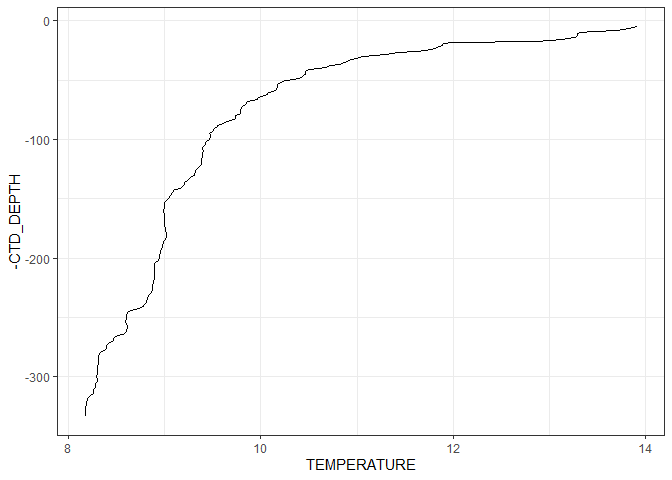

<!-- README.md is generated from README.Rmd. Please edit that file -->

# RREAS 

<!-- badges: start -->
<!-- badges: end -->

This package contains data and support functions for the NOAA NMFS SWFSC
Rockfish Recruitment and Ecosystem Assessment Survey (RREAS).

This is version 0.2.0. Please report any problems!

A manuscript on the RREAS dataset is currently in preparation for the
journal *Scientific Data*. This README will be updated with appropriate
citation information once it is published and available. In the
meantime:

An overview of methods, history, findings, and applications of the
survey can be found
[here](https://storymaps.arcgis.com/collections/af0fa37db2bf4f1cadb024ec0ffbdfb5).

To cite this dataset, please cite:  
Sakuma, K.M., Field, J.C., Mantua, N.J., Ralston, S., Marinovic, B.B.
and Carrion, C.N. (2016) Anomalous epipelagic micronekton assemblage
patterns in the neritic waters of the California Current in spring 2015
during a period of extreme ocean conditions. CalCOFI Rep. 57:163-183

To cite this software package, use `citation(package = "RREAS")`.

Juvenile cowcod illustration in our logo by Sophie Webb.

## Installation

To install the latest version of the package:

``` r
#install.packages("devtools") #if required
devtools::install_github("tanyalrogers/RREAS")
#if that doesn't work, try
pak::pak("tanyalrogers/RREAS")
```

## Package overview

``` r
library(RREAS)
```

The package allows for the loading of data from one of several sources
into a common format that can be acted on by various support functions
included in the package, or used for other analyses.

The package contains a current copy of the RREAS data posted on Dryad
(LINK WILL GO HERE ONCE ACTIVE). The data do not have to be separately
downloaded. The data currently span 1983 to 2025. The trawl-associated
data (`HAUL`, `CATCH`, `LENGTH`, `WEIGHT`, `STATIONS`, `SPECIES_CODES`,
and derived table `HAULSTANDARD`) can be loaded using `load_trawls()`.
The other tables (`CTD_HEADER`, `CTD_CAST`, `NET_MENSURATION`) can be
called directly for lazy loading.

The package also contains a copy of the trawl-associated data (`HAUL`,
`CATCH`, `LENGTH`) posted on
[ERDDAP](https://oceanview.pfeg.noaa.gov/erddap/index.html), which
contain only a subset of the data posted on Dryad. The ERDDAP dataset
contains data from 1990 to 2025 and for standard, active trawl stations
only. The trawl-associated data can be loaded using `load_erddap()`.
Note that the `WEIGHT` table is not included in this dataset, and there
are differences in how the krill and young-of-the-year rockfish MATURITY
is coded: The ERDDAP dataset contains additional SPECIES/MATURITY
categories 1472/T (total krill) and 1940/T (total rockfish). The catch
table on ERDDAP is reformatted into relational `HAUL` and `CATCH` tables
to match the format of the other data sources. The `SPECIES_CODES` and
`STATIONS` tables that are loaded come from Dryad dataset.

For internal users at NOAA, there are functions to load data from a
local copy of the RREAS MS Access Database, which also contains the
NWFSC, PWCC, and ADAMS datasets, as well as the `AGE` table for
age-at-length regressions, and the speciated krill data. Abundance
indices for stock assessments and other ecosystem reports can thus be
produced. The trawl-associated data can be loaded using `load_mdb()`.

Metadata for all data tables can be found under `help("RREAS_TABLES")`.

## Loading trawl data

To load the trawl-associated data, simply run:

``` r
load_trawls()
#> Data loaded.
```

The data tables will be loaded to your global environment:

``` r
ls(name = .GlobalEnv) #list objects in your workspace
#> [1] "CATCH"         "HAUL"          "HAULSTANDARD"  "LENGTH"       
#> [5] "SPECIES_CODES" "STATIONS"      "WEIGHT"
```

In addition to loading the main tables, `load_trawls()` also creates a
HAULSTANDARD table containing only standard stations
(STANDARD_STATION=1) and with a reduced, standardized set of columns
including YEAR, MONTH, JDAY, and lat/lon in decimal degrees. The support
functions described below pull data for the hauls listed in HAULSTANDARD
(unless otherwise specified). By default, HAULSTANDARD contains only
hauls from active stations (omitting inactive stations) and from the
standard survey time period (omitting early surveys, CRUISE 8703, 8804,
and 9003). If you would like to include the inactive stations in
HAULSTANDARD, set `activestationsonly=FALSE` in `load_trawls()`. If you
would like to include the early surveys in HAULSTANDARD, set
`stdtimeperiodonly=FALSE` in `load_trawls()`. A `startyear` can also be
specified (defaults to 1983). Subsetting HAULSTANDARD after loading is
also an acceptable approach.

The ERDDAP data can be loaded in the same way using `load_erddap()`.
This function has no arguments (the dataset does not include data from
the inactive stations or the early surveys).

Note that using any of the `load_xxx()` functions will overwrite
whatever tables currently exist in your global environment.

## Extracting data for species

There are two main data extraction functions: `get_totals` and
`get_distributions`. The function `get_totals` can be used to obtain
total haul-level abundance or biomass. The function `get_distributions`
can be used to obtain size or mass distribution data. Biomass and mass
distribution data are only available for select species.

### Formatting the species table

Both functions require a specially formatted data frame (the
`speciestable`) as an input. This table specifies which species to
extract (multiple species can be specified), whether/how to aggregate
them, and whether any length constraints should be imposed. Data from
multiple species and species groupings can be extracted in one function
call, or they can be extracted separately and appended.

The species table must have the following columns:  
- SPECIES: Species codes  
- MATURITY: Maturity codes  
- NAME: A custom name, typically the common name. Rows with the same
NAME value will be aggregated together.

The table may optionally include:  
- MINLEN: The minimum length in mm, greater than or equal to (if column
is missing or value is NA, defaults to 0)  
- MAXLEN: The maximum length in mm, less than (if column is missing or
value is NA, defaults to Inf)

Here’s an example of of how you might construct a table for YOY Anchovy,
Adult Anchovy, and Total Anchovy:

``` r
anchtable <- data.frame(SPECIES=209, MATURITY=c("Y","A","Y","A"),
                        NAME=c("YOY Anchovy", "Adult Anchovy", "Total Anchovy", "Total Anchovy"))
anchtable
#>   SPECIES MATURITY          NAME
#> 1     209        Y   YOY Anchovy
#> 2     209        A Adult Anchovy
#> 3     209        Y Total Anchovy
#> 4     209        A Total Anchovy
```

If you wanted to split adult Anchovy into two size classes, here’s how
you might do that:

``` r
anchtable_len <- data.frame(SPECIES=209, MATURITY="A",
                            NAME=c("Small adult anchovy", "Large adult anchovy"),
                            MINLEN=c(90,120),
                            MAXLEN=c(120,NA))
anchtable_len
#>   SPECIES MATURITY                NAME MINLEN MAXLEN
#> 1     209        A Small adult anchovy     90    120
#> 2     209        A Large adult anchovy    120     NA
```

The package contains some pre-made species tables with common species
and species groupings, which can be subsetted if desired. You can
explicitly load them to global environment using `data()`, or call them
directly. You can also construct your own custom species table as in the
above examples.

``` r
#Some common species and species groups used in ecosystem reports.
data("sptable")
unique(sptable$NAME) #available species and species groups
#>  [1] "YOY Rockfish"     "Market Squid"     "YOY Pacific Hake" "Adult Anchovy"   
#>  [5] "YOY Anchovy"      "Adult Sardine"    "YOY Sardine"      "Pyrosomes"       
#>  [9] "Thetys"           "Salps"            "YOY Sanddabs"     "Total Myctophids"
#> [13] "Octopus"          "Total Krill"
head(sptable)
#>   SPECIES MATURITY         NAME
#> 1     580        Y YOY Rockfish
#> 2     582        Y YOY Rockfish
#> 3     583        Y YOY Rockfish
#> 4     584        Y YOY Rockfish
#> 5     592        Y YOY Rockfish
#> 6     593        Y YOY Rockfish
```

``` r
#Species for which length-weight regressions exist, and for which biomass can be obtained.
data("sptable_lw")
unique(sptable_lw$NAME) #available species and species groups
#>  [1] "YOY Rockfish"             "Blacksmelt"              
#>  [3] "Adult Pacific sanddab"    "YOY Pacific sanddab"     
#>  [5] "YOY Speckled sanddab"     "YOY Sanddabs"            
#>  [7] "YOY Anchovy"              "Adult Anchovy"           
#>  [9] "Total Anchovy"            "Goby"                    
#> [11] "California Smoothtongue"  "YOY Pacific Hake"        
#> [13] "YOY Lingcod"              "YOY Sardine"             
#> [15] "Adult Sardine"            "Total Sardine"           
#> [17] "Market Squid"             "Sea nettle"              
#> [19] "Octopus"                  "Pyrosome"                
#> [21] "Armhook squid"            "Thetys salp"             
#> [23] "Blacktip squid"           "Moon jelly"              
#> [25] "Boreal clubhook squid"    "Blue lanternfish"        
#> [27] "California headlightfish" "Bigfin lanternfish"      
#> [29] "Nannobrachium spp."       "Mexican lampfish"        
#> [31] "Northern lampfish"        "Total Myctophids"        
#> [33] "Total Krill"              "Carinaria"               
#> [35] "Medusafish"               "King-of-the-salmon"
```

### Getting totals

The function `get_totals` has 5 inputs:  
- `speciestable`: The species table data frame  
- `what`: What kind of total you want, either `"abundance"` or
`"biomass"`. Defaults to `"abundance"`.  
- `startyear`: Start year (optional). Defaults to 1983.  
- `haultable`: Table of hauls to from which to obtain totals. Defaults
to `HAULSTANDARD`.  
- `datasets`: Relevant only for internal users loading multiple datasets
from the MS Access Database. Defaults to RREAS only.

Values will be generated for each unique NAME in `speciestable` for each
haul in HAULSTANDARD (unless another table is specified under
`haultable`). If multiple NAME values are present, the results will be
stacked in long format.

If a station was sampled, but the requested species was *not counted* at
the time, it will appear as an NA. If the species was counted but was
*not present*, it will appear as 0. If the species was counted but the
counts numbers are unreliable (the case for some species prior to 1990,
presence/absence will still be reliable), a message will be displayed.
Description of additional irregularities in species classification can
be found in the `sptable` documentation and in the SPECIES_CODES table.
**It your responsibility to know when your focal species were or were
not being recorded.**

If “abundance” is requested, the output table will include column
TOTAL_NO. If “biomass” is requested, the output table will include
columns TOTAL_NO, NMEAS (number measured), and BIOMASS (g). If you
included length constraints, the output table will include additional
columns NMEAS_SIZE (number measured in the size range), and NSIZE (total
number in the size range, which is probably what you want for abundance,
not TOTAL_NO). BIOMASS with size constraints will be the biomass within
the size range.

Biomass is only available for species with lengths and length-weight
regressions. The table `sptable_lw` lists the species for which lengths
and length-weight regressions are available. See
`help(get_lw_regression)` for more info on how the regressions are done.
(The function `get_lw_regression` is used internally, but can be run
independently if desired.)

If length data are available for a species, but not available for a
particular haul where the species was present, mean length values will
be used. If available, the mean for the same CRUISE and REGION will be
used, followed by CRUISE and STRATA, then CRUISE, then the global mean.
In the output table, if TOTAL_NO\>0 but NMEAS=0, this indicates that
length data were unavailable and means were used. If size limits are
specified, the mean proportion of fish in the length range will also be
used for hauls missing length data, with the same rank ordering of
available mean values.

Examples:

``` r
#YOY, Adult, Total anchovy abundances
anchabund <- get_totals(anchtable, what = "abundance")
tail(anchabund)
#>       SURVEY CRUISE HAUL_NO YEAR MONTH JDAY  HAUL_DATE STATION NET_IN_LATDD
#> 11764  RREAS   2502      93 2025     6  154 2025-06-03     445     35.69450
#> 11765  RREAS   2502      94 2025     6  154 2025-06-03     425     33.91455
#> 11766  RREAS   2502      95 2025     6  154 2025-06-03     424     34.06567
#> 11767  RREAS   2502      97 2025     6  155 2025-06-04     423     34.18832
#> 11768  RREAS   2502      98 2025     6  155 2025-06-04     404     32.72155
#> 11769  RREAS   2502      99 2025     6  155 2025-06-04     403     32.72077
#>       NET_IN_LONDD    LATDD     LONDD BOTTOM_DEPTH STATION_BOTTOM_DEPTH STRATA
#> 11764    -121.8517 35.70333 -121.8667         1051                 1050     SC
#> 11765    -120.6962 33.91833 -120.7117         1831                 1848      S
#> 11766    -120.5621 34.07000 -120.5783          161                  190      S
#> 11767    -120.4504 34.17667 -120.4717          151                  122      S
#> 11768    -119.0345 32.71667 -119.0167          682                  777      S
#> 11769    -118.7646 32.71667 -118.7483         1506                 1253      S
#>                  AREA ACTIVE        NAME TOTAL_NO
#> 11764 Piedras Blancas      Y YOY Anchovy       81
#> 11765      San Miguel      Y YOY Anchovy        0
#> 11766      San Miguel      Y YOY Anchovy        1
#> 11767      San Miguel      Y YOY Anchovy       67
#> 11768    San Clemente      Y YOY Anchovy        0
#> 11769    San Clemente      Y YOY Anchovy        0

#Biomass for different anchovy size classes
anchbiomass_len <- get_totals(anchtable_len, what = "biomass")
#early years use mean lengths and proportion in size class
head(anchbiomass_len)
#>   SURVEY CRUISE HAUL_NO YEAR MONTH JDAY  HAUL_DATE STATION NET_IN_LATDD
#> 1  RREAS   8303      15 1983     6  163 1983-06-12     119           NA
#> 2  RREAS   8303      17 1983     6  164 1983-06-13     114           NA
#> 3  RREAS   8303      18 1983     6  164 1983-06-13     116           NA
#> 4  RREAS   8303      24 1983     6  165 1983-06-14     117           NA
#> 5  RREAS   8303      25 1983     6  165 1983-06-14     113           NA
#> 6  RREAS   8303      29 1983     6  165 1983-06-14     123           NA
#>   NET_IN_LONDD    LATDD     LONDD BOTTOM_DEPTH STATION_BOTTOM_DEPTH STRATA
#> 1           NA 36.84667 -121.9833           80                   91      C
#> 2           NA 36.76667 -121.8667           82                   73      C
#> 3           NA 36.74000 -121.9767          444                  287      C
#> 4           NA 36.70000 -122.1083         1828                 1920      C
#> 5           NA 36.64667 -122.0500         1097                  900      C
#> 6           NA 36.98333 -122.2917           82                   82      C
#>                   AREA ACTIVE                NAME TOTAL_NO NMEAS NMEAS_SIZE
#> 1  Monterey Bay Inside      Y Large adult anchovy      268     0          0
#> 2  Monterey Bay Inside      Y Large adult anchovy       40     0          0
#> 3  Monterey Bay Inside      Y Large adult anchovy       14     0          0
#> 4 Monterey Bay Outside      Y Large adult anchovy        0     0          0
#> 5 Monterey Bay Outside      Y Large adult anchovy        0     0          0
#> 6            Davenport      Y Large adult anchovy      450     0          0
#>        NSIZE   BIOMASS
#> 1 147.678631 3741.2328
#> 2  22.041587  558.3930
#> 3   7.714555  195.4375
#> 4   0.000000    0.0000
#> 5   0.000000    0.0000
#> 6 247.967851 6281.9207
#later years use actual values
tail(anchbiomass_len)
#>      SURVEY CRUISE HAUL_NO YEAR MONTH JDAY  HAUL_DATE STATION NET_IN_LATDD
#> 7841  RREAS   2502      93 2025     6  154 2025-06-03     445     35.69450
#> 7842  RREAS   2502      94 2025     6  154 2025-06-03     425     33.91455
#> 7843  RREAS   2502      95 2025     6  154 2025-06-03     424     34.06567
#> 7844  RREAS   2502      97 2025     6  155 2025-06-04     423     34.18832
#> 7845  RREAS   2502      98 2025     6  155 2025-06-04     404     32.72155
#> 7846  RREAS   2502      99 2025     6  155 2025-06-04     403     32.72077
#>      NET_IN_LONDD    LATDD     LONDD BOTTOM_DEPTH STATION_BOTTOM_DEPTH STRATA
#> 7841    -121.8517 35.70333 -121.8667         1051                 1050     SC
#> 7842    -120.6962 33.91833 -120.7117         1831                 1848      S
#> 7843    -120.5621 34.07000 -120.5783          161                  190      S
#> 7844    -120.4504 34.17667 -120.4717          151                  122      S
#> 7845    -119.0345 32.71667 -119.0167          682                  777      S
#> 7846    -118.7646 32.71667 -118.7483         1506                 1253      S
#>                 AREA ACTIVE                NAME TOTAL_NO NMEAS NMEAS_SIZE NSIZE
#> 7841 Piedras Blancas      Y Small adult anchovy        0     0          0   0.0
#> 7842      San Miguel      Y Small adult anchovy       27    18          3   4.5
#> 7843      San Miguel      Y Small adult anchovy       98    20         16  78.4
#> 7844      San Miguel      Y Small adult anchovy       88    20         20  88.0
#> 7845    San Clemente      Y Small adult anchovy        0     0          0   0.0
#> 7846    San Clemente      Y Small adult anchovy        0     0          0   0.0
#>         BIOMASS
#> 7841    0.00000
#> 7842   81.15633
#> 7843 1309.26418
#> 7844 1142.07881
#> 7845    0.00000
#> 7846    0.00000

#Total YOY rockfish
yoyrockfish <- subset(sptable, NAME=="YOY Rockfish")
yoyrockfishabund <- get_totals(yoyrockfish, what = "abundance")
head(yoyrockfishabund)
#>   SURVEY CRUISE HAUL_NO YEAR MONTH JDAY  HAUL_DATE STATION NET_IN_LATDD
#> 1  RREAS   8303      15 1983     6  163 1983-06-12     119           NA
#> 2  RREAS   8303      17 1983     6  164 1983-06-13     114           NA
#> 3  RREAS   8303      18 1983     6  164 1983-06-13     116           NA
#> 4  RREAS   8303      24 1983     6  165 1983-06-14     117           NA
#> 5  RREAS   8303      25 1983     6  165 1983-06-14     113           NA
#> 6  RREAS   8303      29 1983     6  165 1983-06-14     123           NA
#>   NET_IN_LONDD    LATDD     LONDD BOTTOM_DEPTH STATION_BOTTOM_DEPTH STRATA
#> 1           NA 36.84667 -121.9833           80                   91      C
#> 2           NA 36.76667 -121.8667           82                   73      C
#> 3           NA 36.74000 -121.9767          444                  287      C
#> 4           NA 36.70000 -122.1083         1828                 1920      C
#> 5           NA 36.64667 -122.0500         1097                  900      C
#> 6           NA 36.98333 -122.2917           82                   82      C
#>                   AREA ACTIVE         NAME TOTAL_NO
#> 1  Monterey Bay Inside      Y YOY Rockfish        0
#> 2  Monterey Bay Inside      Y YOY Rockfish        0
#> 3  Monterey Bay Inside      Y YOY Rockfish        1
#> 4 Monterey Bay Outside      Y YOY Rockfish        1
#> 5 Monterey Bay Outside      Y YOY Rockfish        2
#> 6            Davenport      Y YOY Rockfish        0
```

### Getting distributions

The function `get_distributions` has the same 5 inputs, except `what`
should be either `"size"` or `"mass"`. Distributions will be generated
for each unique NAME in `speciestable` for each haul in HAULSTANDARD
(unless another table is specified under `haultable`). If multiple NAME
values are present, the results will be stacked in long format. As with
`get_totals`, length-weight regressions must exist in order to obtain
mass distributions.

If a haul had no fish, it will appear in the output dataset (with
TOTAL_NO=0). If a haul had fish, but no fish were measured, there will
be a TOTAL_NO\>0, NMEAS will be 0, and there will be a single
length/mass entry for that haul, which will be the average value. *For
calculating distributions, you will probably want to exclude any hauls
with NMEAS=0.*

The output table will include TOTAL_NO, NMEAS (number measured), EXP
(expansion factor, TOTAL_NO/NMEAS), SP_NO (specimen number) and values
for the requested distribution. If `"size"` is requested, it will
include column STD_LENGTH. If `"mass"` is requested, it will include
columns STD_LENGTH and WEIGHT (g). If size limits are specified, it will
include additional columns NMEAS_SIZE (number measured in the size
range), PSIZE (proportion of measured fish in the size range), and NSIZE
(total number in the size range, which is probably what you want for
abundance, not TOTAL_NO).

``` r
#Size distribution for anchovy
anchsizedist <- get_distributions(anchtable, what = "size")

#note how the early hauls have no measured fish and use an avg length
#the expansion factor in this case is the total number of fish
head(anchsizedist)
#>   SURVEY CRUISE HAUL_NO YEAR MONTH JDAY  HAUL_DATE STATION NET_IN_LATDD
#> 1  RREAS   8303      15 1983     6  163 1983-06-12     119           NA
#> 2  RREAS   8303      17 1983     6  164 1983-06-13     114           NA
#> 3  RREAS   8303      18 1983     6  164 1983-06-13     116           NA
#> 4  RREAS   8303      24 1983     6  165 1983-06-14     117           NA
#> 5  RREAS   8303      25 1983     6  165 1983-06-14     113           NA
#> 6  RREAS   8303      29 1983     6  165 1983-06-14     123           NA
#>   NET_IN_LONDD    LATDD     LONDD BOTTOM_DEPTH STATION_BOTTOM_DEPTH STRATA
#> 1           NA 36.84667 -121.9833           80                   91      C
#> 2           NA 36.76667 -121.8667           82                   73      C
#> 3           NA 36.74000 -121.9767          444                  287      C
#> 4           NA 36.70000 -122.1083         1828                 1920      C
#> 5           NA 36.64667 -122.0500         1097                  900      C
#> 6           NA 36.98333 -122.2917           82                   82      C
#>                   AREA ACTIVE SPECIES MATURITY          NAME TOTAL_NO NMEAS EXP
#> 1  Monterey Bay Inside      Y     209        A Adult Anchovy      268     0 268
#> 2  Monterey Bay Inside      Y     209        A Adult Anchovy       40     0  40
#> 3  Monterey Bay Inside      Y     209        A Adult Anchovy       14     0  14
#> 4 Monterey Bay Outside      Y     209        A Adult Anchovy        0     0  NA
#> 5 Monterey Bay Outside      Y     209        A Adult Anchovy        0     0  NA
#> 6            Davenport      Y     209        A Adult Anchovy      450     0 450
#>   STD_LENGTH SP_NO
#> 1   120.3036    NA
#> 2   120.3036    NA
#> 3   120.3036    NA
#> 4         NA    NA
#> 5         NA    NA
#> 6   120.3036    NA

#in later years, actual lengths are provided
tail(anchsizedist, 10)
#>       SURVEY CRUISE HAUL_NO YEAR MONTH JDAY  HAUL_DATE STATION NET_IN_LATDD
#> 46351  RREAS   2502      97 2025     6  155 2025-06-04     423     34.18832
#> 46352  RREAS   2502      97 2025     6  155 2025-06-04     423     34.18832
#> 46353  RREAS   2502      97 2025     6  155 2025-06-04     423     34.18832
#> 46354  RREAS   2502      97 2025     6  155 2025-06-04     423     34.18832
#> 46355  RREAS   2502      97 2025     6  155 2025-06-04     423     34.18832
#> 46356  RREAS   2502      97 2025     6  155 2025-06-04     423     34.18832
#> 46357  RREAS   2502      97 2025     6  155 2025-06-04     423     34.18832
#> 46358  RREAS   2502      97 2025     6  155 2025-06-04     423     34.18832
#> 46359  RREAS   2502      98 2025     6  155 2025-06-04     404     32.72155
#> 46360  RREAS   2502      99 2025     6  155 2025-06-04     403     32.72077
#>       NET_IN_LONDD    LATDD     LONDD BOTTOM_DEPTH STATION_BOTTOM_DEPTH STRATA
#> 46351    -120.4504 34.17667 -120.4717          151                  122      S
#> 46352    -120.4504 34.17667 -120.4717          151                  122      S
#> 46353    -120.4504 34.17667 -120.4717          151                  122      S
#> 46354    -120.4504 34.17667 -120.4717          151                  122      S
#> 46355    -120.4504 34.17667 -120.4717          151                  122      S
#> 46356    -120.4504 34.17667 -120.4717          151                  122      S
#> 46357    -120.4504 34.17667 -120.4717          151                  122      S
#> 46358    -120.4504 34.17667 -120.4717          151                  122      S
#> 46359    -119.0345 32.71667 -119.0167          682                  777      S
#> 46360    -118.7646 32.71667 -118.7483         1506                 1253      S
#>               AREA ACTIVE SPECIES MATURITY        NAME TOTAL_NO NMEAS  EXP
#> 46351   San Miguel      Y     209        Y YOY Anchovy       67    20 3.35
#> 46352   San Miguel      Y     209        Y YOY Anchovy       67    20 3.35
#> 46353   San Miguel      Y     209        Y YOY Anchovy       67    20 3.35
#> 46354   San Miguel      Y     209        Y YOY Anchovy       67    20 3.35
#> 46355   San Miguel      Y     209        Y YOY Anchovy       67    20 3.35
#> 46356   San Miguel      Y     209        Y YOY Anchovy       67    20 3.35
#> 46357   San Miguel      Y     209        Y YOY Anchovy       67    20 3.35
#> 46358   San Miguel      Y     209        Y YOY Anchovy       67    20 3.35
#> 46359 San Clemente      Y     209        Y YOY Anchovy        0     0   NA
#> 46360 San Clemente      Y     209        Y YOY Anchovy        0     0   NA
#>       STD_LENGTH SP_NO
#> 46351         85 16378
#> 46352         76 16379
#> 46353         78 16380
#> 46354         86 16381
#> 46355         85 16382
#> 46356         82 16383
#> 46357         80 16384
#> 46358         79 16385
#> 46359         NA    NA
#> 46360         NA    NA

#Mass distribution for different anchovy size classes
anchmassdist <- get_distributions(anchtable_len, what = "mass")
tail(anchmassdist, 10)
#>       SURVEY CRUISE HAUL_NO YEAR MONTH JDAY  HAUL_DATE STATION NET_IN_LATDD
#> 17514  RREAS   2502      97 2025     6  155 2025-06-04     423     34.18832
#> 17515  RREAS   2502      97 2025     6  155 2025-06-04     423     34.18832
#> 17516  RREAS   2502      97 2025     6  155 2025-06-04     423     34.18832
#> 17517  RREAS   2502      97 2025     6  155 2025-06-04     423     34.18832
#> 17518  RREAS   2502      97 2025     6  155 2025-06-04     423     34.18832
#> 17519  RREAS   2502      97 2025     6  155 2025-06-04     423     34.18832
#> 17520  RREAS   2502      97 2025     6  155 2025-06-04     423     34.18832
#> 17521  RREAS   2502      97 2025     6  155 2025-06-04     423     34.18832
#> 17522  RREAS   2502      98 2025     6  155 2025-06-04     404     32.72155
#> 17523  RREAS   2502      99 2025     6  155 2025-06-04     403     32.72077
#>       NET_IN_LONDD    LATDD     LONDD BOTTOM_DEPTH STATION_BOTTOM_DEPTH STRATA
#> 17514    -120.4504 34.17667 -120.4717          151                  122      S
#> 17515    -120.4504 34.17667 -120.4717          151                  122      S
#> 17516    -120.4504 34.17667 -120.4717          151                  122      S
#> 17517    -120.4504 34.17667 -120.4717          151                  122      S
#> 17518    -120.4504 34.17667 -120.4717          151                  122      S
#> 17519    -120.4504 34.17667 -120.4717          151                  122      S
#> 17520    -120.4504 34.17667 -120.4717          151                  122      S
#> 17521    -120.4504 34.17667 -120.4717          151                  122      S
#> 17522    -119.0345 32.71667 -119.0167          682                  777      S
#> 17523    -118.7646 32.71667 -118.7483         1506                 1253      S
#>               AREA ACTIVE SPECIES MATURITY                NAME TOTAL_NO NMEAS
#> 17514   San Miguel      Y     209        A Small adult anchovy       88    20
#> 17515   San Miguel      Y     209        A Small adult anchovy       88    20
#> 17516   San Miguel      Y     209        A Small adult anchovy       88    20
#> 17517   San Miguel      Y     209        A Small adult anchovy       88    20
#> 17518   San Miguel      Y     209        A Small adult anchovy       88    20
#> 17519   San Miguel      Y     209        A Small adult anchovy       88    20
#> 17520   San Miguel      Y     209        A Small adult anchovy       88    20
#> 17521   San Miguel      Y     209        A Small adult anchovy       88    20
#> 17522 San Clemente      Y     209        A Small adult anchovy        0     0
#> 17523 San Clemente      Y     209        A Small adult anchovy        0     0
#>       NMEAS_SIZE EXP PSIZE NSIZE STD_LENGTH SP_NO   WEIGHT
#> 17514         20 4.4     1    88        101 16358 10.60760
#> 17515         20 4.4     1    88        108 16359 13.33114
#> 17516         20 4.4     1    88        106 16360 12.50784
#> 17517         20 4.4     1    88        110 16361 14.19203
#> 17518         20 4.4     1    88        105 16362 12.10997
#> 17519         20 4.4     1    88        110 16363 14.19203
#> 17520         20 4.4     1    88        106 16364 12.50784
#> 17521         20 4.4     1    88        103 16365 11.34121
#> 17522          0  NA    NA     0         NA    NA       NA
#> 17523          0  NA    NA     0         NA    NA       NA
```

Note that if you are combining distributions across hauls, they will
need to be weighted by the total number of individuals caught. This is
most easily done by binning the lengths and summing the expansion
factors.

``` r
library(ggplot2)
library(dplyr)

binwidth <- 6
breaks <- seq(min(anchsizedist$STD_LENGTH, na.rm = T),
              max(anchsizedist$STD_LENGTH, na.rm = T), by = binwidth)

anchsizedist$bin=cut(anchsizedist$STD_LENGTH, breaks, labels = breaks[-1]-binwidth/2)

anchsizedist_sum=anchsizedist %>% 
  filter(NAME %in% c("Adult Anchovy", "YOY Anchovy")) %>% 
  filter(YEAR %in% c(2024,2025)) %>% #for a simpler figure
  filter(NMEAS>0) %>% #remove hauls with no fish measured
  group_by(NAME, YEAR, bin) %>% 
  summarise(total=sum(EXP, na.rm=T)) %>% 
  group_by(NAME, YEAR) %>% 
  mutate(Proportion=total/sum(total))

ggplot(anchsizedist_sum, aes(x=as.numeric(as.character(bin)), y=Proportion)) +
  facet_grid(NAME~YEAR, scale="free_y") +
  geom_col(width = binwidth, color="black") + theme_bw() +
  scale_y_continuous(expand = expansion(mult = c(0,0.05))) +
  scale_x_continuous(expand = c(0,0)) +
  labs(x="Length (mm)")
```


## Generating indices

Given an output table from `get_totals`, there is a function
`get_logcpueindex` which will compute `mean(log(x+1))` for an `x` of
your choice, for each YEAR and NAME. It allows optional grouping
variables (typically STRATA). A standardized index (within groups) is
also computed by default, but can be turned off by setting
`standardized=FALSE`.

``` r
anchindex1 <- get_logcpueindex(anchabund, var = "TOTAL_NO", group="STRATA")
head(anchindex1)
#>          NAME STRATA YEAR TOTAL_NO_INDEX TOTAL_NO_INDEX_SC
#> 1 YOY Anchovy      C 1983     0.00000000        -0.6533485
#> 2 YOY Anchovy      C 1984     0.04993692        -0.5766905
#> 3 YOY Anchovy      C 1985     0.08788898        -0.5184304
#> 4 YOY Anchovy      C 1986     0.72783491         0.4639483
#> 5 YOY Anchovy      C 1987     0.49435915         0.1055405
#> 6 YOY Anchovy      C 1988     0.17104788        -0.3907735

anchindex1plot <- anchindex1 %>% 
  #filter(!(YEAR<2004 & STRATA!="C")) %>% #exclude non-core areas before 2004
  mutate(STRATA=factor(STRATA, levels = c("N","NC","C","SC","S")))
ggplot(anchindex1plot,aes(y=TOTAL_NO_INDEX,x=YEAR)) +
  facet_grid(STRATA~NAME) +
  geom_point() + geom_line() +
  theme_bw() +
  labs(x="Year", y="log Abundance")
```


``` r

anchindex2 <- get_logcpueindex(anchbiomass_len, var = "BIOMASS", group="STRATA")
head(anchindex2)
#>                  NAME STRATA YEAR BIOMASS_INDEX BIOMASS_INDEX_SC
#> 1 Small adult anchovy      C 1983     2.0667368       0.57940510
#> 2 Small adult anchovy      C 1984     3.0245233       1.28985617
#> 3 Small adult anchovy      C 1985     2.6257930       0.99409260
#> 4 Small adult anchovy      C 1986     0.4274875      -0.63653022
#> 5 Small adult anchovy      C 1987     1.1542176      -0.09746837
#> 6 Small adult anchovy      C 1988     1.1463669      -0.10329174

anchindex2plot <- anchindex2 %>% 
  #filter(!(YEAR<2004 & STRATA!="C")) %>% #exclude non-core areas before 2004
  mutate(STRATA=factor(STRATA, levels = c("N","NC","C","SC","S")))
ggplot(anchindex2plot,aes(y=BIOMASS_INDEX,x=YEAR)) +
  facet_grid(STRATA~NAME) +
  geom_point() + geom_line() +
  theme_bw() +
  labs(x="Year", y="log Biomass")
```


## Depth-stratified trawls

RREAS standard trawls are conducted at 30 m headrope depth (DEPTH_STRATA
2), with the exception of stations with a bottom depth of less than 60
m, which are towed at 10 m headrope depth (DEPTH_STRATA 1). These are
the hauls which appear in HAULSTANDARD.

Historically, mostly before the coastwide expansion in 2004, multiple
depth strata (DEPTH_STRATA 1: 10 m, DEPTH_STRATA 2: 30 m, DEPTH_STRATA
3: 90 m) were sampled in succession at specific stations, mostly at
stations 110, 125, 133, and 170, but occasionally others. The function
`load_depth_stratified_trawls` pulls out these depth-stratified trawls
into the table HAULDEPTHSTRATIFED. It has the same format as
HAULSTANDARD, but with a few extra columns: DEPTH_STRATA, SWEEP
(indicates which of the 3 passes the sampling is from; there is
generally one set of depth-stratified trawls per sweep, but not always),
and SWEEP_SEP (separates cases in which there are multiple sets of depth
stratified trawls per sweep, and sets of depth stratified trawls where
SWEEP in NA, which occurs after 2004; otherwise equal to SWEEP). Each
set of consecutive depth stratified trawls will have a unique
CRUISE/STATION/SWEEP_SEP value.

HAULDEPTHSTRATIFED can be passed to `get_totals` or `get_distributions`
to get catch data from these hauls instead of HAULSTANDARD by supplying
it under `haultable`. Note that all of the depth-stratified trawls are
not present in the ERDDAP dataset.

Note that to get *all* of the depth-stratified trawls, you have to
include the non-active stations (`activestationsonly = FALSE`).

``` r
load_trawls(activestationsonly = FALSE)
#> Data loaded.
load_depth_stratified_trawls()
#> HAULDEPTHSTRATIFED created.
str(HAULDEPTHSTRATIFIED)
#> 'data.frame':    669 obs. of  20 variables:
#>  $ SURVEY              : chr  "RREAS" "RREAS" "RREAS" "RREAS" ...
#>  $ CRUISE              : chr  "8303" "8303" "8303" "8303" ...
#>  $ HAUL_NO             : int  22 23 31 32 38 40 41 30 31 33 ...
#>  $ YEAR                : num  1983 1983 1983 1983 1983 ...
#>  $ MONTH               : num  6 6 6 6 6 6 6 6 6 6 ...
#>  $ JDAY                : num  165 165 166 166 166 167 167 166 166 167 ...
#>  $ HAUL_DATE           : POSIXct, format: "1983-06-14" "1983-06-14" ...
#>  $ STATION             : int  118 118 125 125 132 132 132 103 103 106 ...
#>  $ NET_IN_LATDD        : num  NA NA NA NA NA ...
#>  $ NET_IN_LONDD        : num  NA NA NA NA NA ...
#>  $ LATDD               : num  36.8 36.8 37 37 37.3 ...
#>  $ LONDD               : num  -122 -122 -122 -122 -123 ...
#>  $ BOTTOM_DEPTH        : int  841 822 505 170 98 100 100 102 102 899 ...
#>  $ STATION_BOTTOM_DEPTH: int  966 966 272 272 95 95 95 102 102 928 ...
#>  $ STRATA              : chr  "C" "C" "C" "C" ...
#>  $ AREA                : chr  "Monterey Bay Outside" "Monterey Bay Outside" "Davenport" "Davenport" ...
#>  $ ACTIVE              : chr  "N" "N" "Y" "Y" ...
#>  $ DEPTH_STRATA        : int  3 2 2 3 2 3 1 1 2 2 ...
#>  $ SWEEP               : int  1 1 1 1 1 1 1 1 1 1 ...
#>  $ SWEEP_SEP           : num  1 1 1 1 1 1 1 1 1 1 ...

anchabund_ds <- get_totals(anchtable, what = "abundance", haultable = HAULDEPTHSTRATIFIED)

#to get depth stratified trawls with all 3 strata sampled
HAULDEPTHSTRATIFIED <- HAULDEPTHSTRATIFIED %>% 
  group_by(CRUISE,STATION,SWEEP_SEP) %>%
  mutate(ustrata=length(unique(DEPTH_STRATA)))
filter(HAULDEPTHSTRATIFIED, ustrata==3) %>% nrow()
#> [1] 441
filter(HAULDEPTHSTRATIFIED, ustrata==3 & YEAR>=1990) %>% nrow()
#> [1] 288

#see which hauls have CTDs
HAULDEPTHSTRATIFIED <- HAULDEPTHSTRATIFIED %>%
  left_join(HAUL %>% select(CRUISE, HAUL_NO, CTD_INDEX), by = c("CRUISE", "HAUL_NO"))
```

## Trawls aborted due to gelatinous organisms

For calculations involving jellies (specifically SPECIES 2840 moon
jelly, 1766 sea nettle, and 2842 egg jelly) and/and pelagic tunicates
(SPECIES 2393 salps, 2058 pyrosomes), users should consider using trawls
with PROBLEM=3 for jellies and/or PROBLEM=9 for pelagic tunicates. These
were trawls where those organisms were so abundant that a valid trawl
was not possible and catch data are missing or inaccurate. The NOTES
column will indicate the specific species involved, if it was recorded.
Some of these hauls have accurate values in the CATCH table for the
gelatinous organisms only, but not any other species. These problem
codes include hauls with HAUL_NO ≥ 900, which are hauls skipped due to
high abundance of gelatinous organisms. For catch numbers in the case of
missing data, the maximum valid catch (or average of the five largest
valid catches) for those organisms could be used as a substitute, as has
been done in prior studies.

At present, requesting totals or distributions for these species does
not account for the aborted trawls. A way to do this more easily within
the package architecture is something we plan to incorporate into future
versions of the package.

``` r
jellytrawls <- subset(HAUL, PROBLEM==3)
head(jellytrawls[,c("CRUISE","HAUL_NO","STATION","PROBLEM","NOTES")])
#>     CRUISE HAUL_NO STATION PROBLEM
#> 30    0002     127     138       3
#> 100   0002      77     139       3
#> 111   0002      87     137       3
#> 112   0002      88     119       3
#> 116   0002     900     119       3
#> 144   0103     116     165       3
#>                                                  NOTES
#> 30       Mostly Aurelia spp. Some Chrysaora fuscescens
#> 100                                               <NA>
#> 111                               Chrysaora fuscescens
#> 112                                       Aurelia spp.
#> 116      No trawl due to large numbers of Aurelia spp.
#> 144 Blew out net with Aurelia and Chrysaora fuscescens

tunicatetrawls <- subset(HAUL, PROBLEM==9)
head(tunicatetrawls[,c("CRUISE","HAUL_NO","STATION","PROBLEM","NOTES")])
#>      CRUISE HAUL_NO STATION PROBLEM                   NOTES
#> 1579   1203     900     110       9 Too many salps in bongo
#> 1580   1203     901     109       9 Too many salps in bongo
#> 1581   1203     902     401       9 Too many salps in bongo
#> 1582   1203     903     444       9 Too many salps in bongo
#> 1583   1203     904     445       9 Too many salps in bongo
#> 1584   1203     905     134       9 Too many salps in bongo
```

## CTD data

To load the CTD data, just call the names of the tables. You can
explicitly load them to global environment using `data()`, or call them
directly. The CTD_CAST table is quite large, so it intentionally not
loaded automatically with the trawl data.

``` r
head(CTD_HEADER)
#>   CRUISE CTD_INDEX CTD_NO STATION            CTD_DATE  CTD_LAT  CTD_LONG
#> 1   0002         2      5     119 2000-05-11 20:42:00 36.84350 -121.9830
#> 2   0002         3      5     114 2000-05-11 22:54:00 36.76667 -121.8678
#> 3   0002         4      5     116 2000-05-11 23:50:00 36.73933 -121.9780
#> 4   0002         5      5     115 2000-05-12 01:58:00 36.70650 -121.8947
#> 5   0002         6      5     111 2000-05-12 02:40:00 36.64400 -121.8622
#> 6   0002         7      5     112 2000-05-12 04:35:00 36.67933 -121.9445
#>   CTD_BOTTOM_DEPTH BUCKET_TEMP BUCKET_SAL TS_TEMP TS_SAL
#> 1               89        11.3       33.7   11.48  33.27
#> 2               66        12.0       33.4   12.26  33.01
#> 3              330        11.7       33.4   11.92  33.24
#> 4               81        11.0       33.4   11.27  33.17
#> 5               43        12.6       33.3   12.90  32.97
#> 6               93        11.1       33.4   11.30  33.21
example_cast <- subset(CTD_CAST, CRUISE=="2502" & CTD_INDEX==100)
head(example_cast)
#>         CRUISE CTD_INDEX CTD_DEPTH TEMPERATURE SALINITY DENSITY DYN_HGT IRRAD
#> 1497874   2502       100         5     13.9108  33.6993 25.2006  0.0115    NA
#> 1497875   2502       100         6     13.8775  33.6962 25.2052  0.0143    NA
#> 1497876   2502       100         7     13.7692  33.6965 25.2278  0.0170    NA
#> 1497877   2502       100         8     13.7109  33.6911 25.2357  0.0198    NA
#> 1497878   2502       100         9     13.4723  33.6863 25.2806  0.0225    NA
#> 1497879   2502       100        10     13.3262  33.6858 25.3099  0.0252    NA
#>         FLUOR_VOLT TRANSMISSIVITY CHLOROPHYLL OXYGEN_VOLT OXYGEN
#> 1497874     0.6474             NA    5.103695      4.5617 7.1594
#> 1497875     0.6487             NA    5.086010      4.5227 7.0425
#> 1497876     0.6632             NA    5.168427      4.4790 6.8909
#> 1497877     0.6768             NA    5.247373      4.3626 6.3654
#> 1497878     0.6058             NA    4.713974      4.1799 5.9748
#> 1497879     0.4047             NA    3.237145      4.0232 5.9272
ggplot(example_cast, aes(y=-CTD_DEPTH, x=TEMPERATURE)) +
  geom_path() + theme_bw()
```



## Internal users

The function `load_mdb` loads data from a local copy of the RREAS MS
Access Database. It has the same arguments and defaults as `load_trawls`
plus an additional `datasets` argument that can be used to load the
additional datasets: NWFSC, PWCC, and ADAMS. The default behavior of
`load_mdb` is to load just the RREAS data (`datasets = "RREAS"`). The
AGE table will also be loaded.

To use `load_mdb`, you will need to specify the file path to the local
MS Access Database.

``` r
#replace the file paths with those for your machine
#any previously loaded tables with the same name in your workspace will be overwritten
rm(list = ls()) #clear workspace
load_mdb(mdb_path="C:/Rogers/Documents/Rockfish/RREAS/Survey data/juv_cruise_backup22APR26.mdb",
         krill_len_path="C:/Rogers/Documents/Rockfish/Index generation/length weight/krill_lengths.csv")
#> Data loaded.
ls(name = .GlobalEnv) #list objects in your workspace
#>  [1] "AGE"                 "CATCH"               "HAUL"               
#>  [4] "HAULDEPTHSTRATIFIED" "HAULSTANDARD"        "krill_length"       
#>  [7] "LENGTH"              "SPECIES_CODES"       "sptable"            
#> [10] "sptable_lw"          "STATIONS"            "WEIGHT"
```

Currently, the krill lengths are not in the database, so must be
supplied as a separate file. This file is *not necessary* however,
unless you want to get krill biomass or length distributions. Just omit
this argument if you don’t have the file.

As before, if you would like to include the inactive stations in
HAULSTANDARD, set `activestationsonly=FALSE`. If you would like to
include the early surveys in HAULSTANDARD, set
`stdtimeperiodonly=FALSE`.

To load data from multiple datasets, specify which ones under
`datasets`.

``` r
#replace the file paths with those for your machine
load_mdb(mdb_path="C:/Rogers/Documents/Rockfish/RREAS/Survey data/juv_cruise_backup22APR26.mdb",
         krill_len_path="C:/Users/trogers/Documents/Rockfish/Index generation/length weight/krill_lengths.csv",
         datasets = c("RREAS","ADAMS","PWCC","NWFSC"),
         activestationsonly = TRUE)
#> Note: HAULSTANDARD_PWCC has missing STATION numbers.
#> Note: HAULSTANDARD_NWFSC has missing STATION numbers.
#> Data loaded.
ls(name = .GlobalEnv) #list objects in your workspace
#>  [1] "AGE"                 "CATCH"               "CATCH_ADAMS"        
#>  [4] "CATCH_NWFSC"         "CATCH_PWCC"          "HAUL"               
#>  [7] "HAUL_ADAMS"          "HAUL_NWFSC"          "HAUL_PWCC"          
#> [10] "HAULDEPTHSTRATIFIED" "HAULSTANDARD"        "HAULSTANDARD_ADAMS" 
#> [13] "HAULSTANDARD_NWFSC"  "HAULSTANDARD_PWCC"   "krill_length"       
#> [16] "LENGTH"              "LENGTH_ADAMS"        "LENGTH_NWFSC"       
#> [19] "LENGTH_PWCC"         "SPECIES_CODES"       "sptable"            
#> [22] "sptable_lw"          "STATIONS"            "STATIONS_NWFSC"     
#> [25] "WEIGHT"
```

There is another, optional argument to load `atsea.mdb` and append the
current year’s data if it is not in the primary database. See
`help(load_mdb)` for more information.

The data extraction functions `get_totals` and `get_distributions` are
used in the same way as described above, but you can specify which
`datasets` to pull data from (if they have been loaded). Only one table
is outputted, so if you request data from multiple datasets, they
results will be combined (column SURVEY differentiates source).

``` r
#Anchovy from RREAS and NWFSC surveys
anchtabletotal <- data.frame(SPECIES=209, MATURITY=c("Y","A"),
                             NAME=c("Total Anchovy", "Total Anchovy"))
anchabund <- get_totals(anchtabletotal, datasets = c("RREAS","NWFSC"), what = "abundance")
table(anchabund$SURVEY)
#> 
#> NWFSC RREAS 
#>   381  3967
```

In addition, `get_totals` can be used to obtain total haul-level 100-day
standardized abundance (`what = "100day"`), and `get_distributions` can
be used to obtain age distribution data (`what = "age"`).

100-day standardized abundance and age distribution are only available
for species with length-age regressions. This includes the rockfish
species listed in `sptable_rockfish100`, hake (382), and lingcod (448).
See `help(get_la_regression)` and `help(age_to_100day)` for more details
on how the regressions are done. (These functions are also used
internally, but can be run independently if desired.)

``` r
#Rockfish species used in the 100 day standardized abundance index
data("sptable_rockfish100")
sptable_rockfish100
#>    SPECIES MATURITY NAME MINLEN      COMMON
#> 1      582        Y  aur     20       Brown
#> 2      597        Y  ent     20       Widow
#> 3      599        Y  fla     20  Yellowtail
#> 4      601        Y  goo     20 Chilipepper
#> 5      603        Y  hop     20  Squarespot
#> 6      604        Y  jor     20  Shortbelly
#> 7      606        Y  lev     20      Cowcod
#> 8      609        Y  mel     20       Black
#> 9      612        Y  mys     20        Blue
#> 10     616        Y  pau     20    Bocaccio
#> 11     618        Y  pin     20      Canary
#> 12     627        Y  sax     20  Stripetail

#100 day standardized rockfish abundance
rockfish100equiv <- get_totals(sptable_rockfish100, what = "100day")
tail(rockfish100equiv)
#>       SURVEY CRUISE HAUL_NO YEAR MONTH JDAY           HAUL_DATE STATION
#> 47071  RREAS   2502     152 2025     6  168 2025-06-17 23:44:50     473
#> 47072  RREAS   2502     153 2025     6  169 2025-06-18 01:49:48     474
#> 47073  RREAS   2502     154 2025     6  169 2025-06-18 04:02:36     475
#> 47074  RREAS   2502     155 2025     6  169 2025-06-18 22:17:55     139
#> 47075  RREAS   2502     156 2025     6  170 2025-06-19 00:17:54     138
#> 47076  RREAS   2502     157 2025     6  170 2025-06-19 02:44:32     237
#>       NET_IN_LATDD NET_IN_LONDD    LATDD     LONDD BOTTOM_DEPTH
#> 47071     39.83306    -124.0958 39.83333 -124.1083          289
#> 47072     39.82083    -124.3966 39.83333 -124.4000         1659
#> 47073     39.82567    -124.7095 39.83333 -124.7167         1350
#> 47074     37.77747    -122.8630 37.79167 -122.8667           60
#> 47075     37.69225    -122.9077 37.70000 -122.9083           56
#> 47076     37.59152    -122.8371 37.59667 -122.8317           71
#>       STATION_BOTTOM_DEPTH STRATA                   AREA ACTIVE NAME TOTAL_NO
#> 47071                  236     NC                Delgada      Y  sax        0
#> 47072                 1600     NC                Delgada      Y  sax        0
#> 47073                 1344     NC                Delgada      Y  sax        0
#> 47074                   55      C Gulf of the Farallones      Y  sax        0
#> 47075                   55      C Gulf of the Farallones      Y  sax        0
#> 47076                   74      C Gulf of the Farallones      Y  sax        0
#>       NMEAS NMEAS_SIZE NSIZE N100
#> 47071     0          0     0    0
#> 47072     0          0     0    0
#> 47073     0          0     0    0
#> 47074     0          0     0    0
#> 47075     0          0     0    0
#> 47076     0          0     0    0

#generate index
rockfish100index <- get_logcpueindex(rockfish100equiv, var="N100", group="STRATA")
head(rockfish100index)
#>   NAME STRATA YEAR N100_INDEX N100_INDEX_SC
#> 1  aur      C 1983 0.00000000    -0.6996813
#> 2  aur      C 1984 0.22593180     0.6959286
#> 3  aur      C 1985 0.00000000    -0.6996813
#> 4  aur      C 1986 0.35444641     1.4897800
#> 5  aur      C 1987 0.01188546    -0.6262632
#> 6  aur      C 1988 0.00000000    -0.6996813

rf100plot <- rockfish100index %>% 
  filter(STRATA=="C" & NAME!="mel" & NAME!="lev") %>% 
  left_join(sptable_rockfish100, by = "NAME")
ggplot(rf100plot,aes(y=N100_INDEX_SC,x=YEAR, group=COMMON, color=COMMON)) +
  geom_point() + geom_line() +
  theme_bw() +
  labs(x="Year", y="log 100-day standardized abundance", color="Rockfish species")
```


If “age” is requested in `get_distributions`, the output will include
columns STD_LENGTH, AGE, N100i (number of 100 day equivalents), and
JDAY_DOB (date of birth).

``` r
#rockfish age distributions
rockfish100agedist <- get_distributions(sptable_rockfish100, what = "age")
tail(rockfish100agedist)
#>        SURVEY CRUISE HAUL_NO YEAR MONTH JDAY           HAUL_DATE STATION
#> 123398  RREAS   2502     152 2025     6  168 2025-06-17 23:44:50     473
#> 123399  RREAS   2502     153 2025     6  169 2025-06-18 01:49:48     474
#> 123400  RREAS   2502     154 2025     6  169 2025-06-18 04:02:36     475
#> 123401  RREAS   2502     155 2025     6  169 2025-06-18 22:17:55     139
#> 123402  RREAS   2502     156 2025     6  170 2025-06-19 00:17:54     138
#> 123403  RREAS   2502     157 2025     6  170 2025-06-19 02:44:32     237
#>        NET_IN_LATDD NET_IN_LONDD    LATDD     LONDD BOTTOM_DEPTH
#> 123398     39.83306    -124.0958 39.83333 -124.1083          289
#> 123399     39.82083    -124.3966 39.83333 -124.4000         1659
#> 123400     39.82567    -124.7095 39.83333 -124.7167         1350
#> 123401     37.77747    -122.8630 37.79167 -122.8667           60
#> 123402     37.69225    -122.9077 37.70000 -122.9083           56
#> 123403     37.59152    -122.8371 37.59667 -122.8317           71
#>        STATION_BOTTOM_DEPTH STRATA                   AREA ACTIVE SPECIES
#> 123398                  236     NC                Delgada      Y     627
#> 123399                 1600     NC                Delgada      Y     627
#> 123400                 1344     NC                Delgada      Y     627
#> 123401                   55      C Gulf of the Farallones      Y     627
#> 123402                   55      C Gulf of the Farallones      Y     627
#> 123403                   74      C Gulf of the Farallones      Y     627
#>        MATURITY NAME TOTAL_NO NMEAS NMEAS_SIZE EXP PSIZE NSIZE STD_LENGTH SP_NO
#> 123398        Y  sax        0     0          0  NA    NA     0         NA    NA
#> 123399        Y  sax        0     0          0  NA    NA     0         NA    NA
#> 123400        Y  sax        0     0          0  NA    NA     0         NA    NA
#> 123401        Y  sax        0     0          0  NA    NA     0         NA    NA
#> 123402        Y  sax        0     0          0  NA    NA     0         NA    NA
#> 123403        Y  sax        0     0          0  NA    NA     0         NA    NA
#>        AGE N100i JDAY_DOB
#> 123398  NA    NA       NA
#> 123399  NA    NA       NA
#> 123400  NA    NA       NA
#> 123401  NA    NA       NA
#> 123402  NA    NA       NA
#> 123403  NA    NA       NA
```

------------------------------------------------------------------------

## Disclaimer

“This repository is a scientific product and is not official
communication of the National Oceanic and Atmospheric Administration, or
the United States Department of Commerce. All NOAA GitHub project code
is provided on an ‘as is’ basis and the user assumes responsibility for
its use. Any claims against the Department of Commerce or Department of
Commerce bureaus stemming from the use of this GitHub project will be
governed by all applicable Federal law. Any reference to specific
commercial products, processes, or services by service mark, trademark,
manufacturer, or otherwise, does not constitute or imply their
endorsement, recommendation or favoring by the Department of Commerce.
The Department of Commerce seal and logo, or the seal and logo of a DOC
bureau, shall not be used in any manner to imply endorsement of any
commercial product or activity by DOC or the United States Government.”
