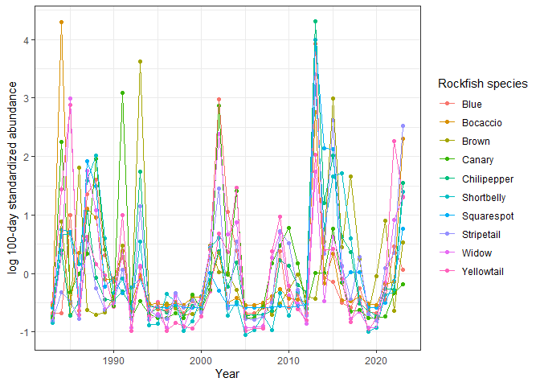

<!-- README.md is generated from README.Rmd. Please edit that file -->

# RREAS 

<!-- badges: start -->
<!-- badges: end -->

This package contains data and support functions for the NOAA SWFSC
Rockfish Recruitment and Ecosystem Assessment Survey (RREAS).

This is version 0.1.4. Please report any problems!

An overview of methods, history, findings, and applications of the
survey can be found
[here](https://storymaps.arcgis.com/collections/af0fa37db2bf4f1cadb024ec0ffbdfb5).

To cite this dataset, please cite:  
Sakuma, K.M., Field, J.C., Mantua, N.J., Ralston, S., Marinovic, B.B.
and Carrion, C.N. (2016) Anomalous epipelagic micronekton assemblage
patterns in the neritic waters of the California Current in spring 2015
during a period of extreme ocean conditions. CalCOFI Rep. 57:163-183

To cite this software package, use `citation(package = "RREAS")`.

Juvenile cowcod illustration in our logo by Sophie Webb.

## Installation

To install the latest version of the package:

``` r
install.packages("devtools") #if required
devtools::install_github("tanyalrogers/RREAS")
```

## Loading data

``` r
library(RREAS)
```

There are two different functions for loading RREAS data:

- `load_erddap` loads the survey data as it is currently stored on
  [ERDDAP](https://oceanview.pfeg.noaa.gov/erddap/index.html), which
  contains data from 1990 to 2022 for standard, active stations only.
  The data tables are contained within the package and are reformatted
  as relational tables (HAUL, CATCH, LENGTH, SPECIES_CODES) to match the
  format in the database. A HAULSTANDARD table is also loaded with a
  standardized set of columns matching those produced by `load_mdb`.
  Note that the AGE and WEIGHT tables are not included in this dataset.

- `load_mdb` loads data from a local copy of the RREAS MS Access
  Database (required to use this function). This function will load the
  HAUL, CATCH, and LENGTH tables from one (or more) surveys in the RREAS
  database, along with the AGE, WEIGHT, and SPECIES_CODES tables from
  RREAS. It also creates and loads a HAULSTANDARD table containing only
  standard stations and with a standardized set of columns including
  YEAR, MONTH, JDAY, and lat/lon in decimal degrees. HAULSTANDARD tables
  all have the same format and so tables from multiple surveys can be
  stacked with `rbind`.

Metadata for the ERDDAP tables (also applicable to the mdb tables) can
be found under `help(RREAS_ERDDAP)`.

To load the ERDDAP data, simply run:

``` r
load_erddap()
#> Data loaded.
```

You will see that the data tables are loaded to your global environment:

``` r
ls(name = .GlobalEnv) #list objects in your workspace
#> [1] "CATCH"         "HAUL"          "HAULSTANDARD"  "LENGTH"       
#> [5] "SPECIES_CODES"
```

To load data from a local MS Access Database, you will need to specify
the file path to the database. The default behavior of `load_mdb` is to
load just the RREAS data (`datasets = "RREAS"`), with HAULSTANDARD
containing only active stations (`activestationsonly = TRUE`):

``` r
#replace the file paths with those for your machine
#any previously loaded tables with the same name in your workspace will be overwritten
load_mdb(mdb_path="C:/Users/trogers/Documents/Rockfish/RREAS/Survey data/juv_cruise_backup10JAN24.mdb",
         krill_len_path="C:/Users/trogers/Documents/Rockfish/Index generation/length weight/krill_lengths.csv")
#> Data loaded.
ls(name = .GlobalEnv) #list objects in your workspace
#> [1] "AGE"           "CATCH"         "HAUL"          "HAULSTANDARD" 
#> [5] "krill_length"  "LENGTH"        "SPECIES_CODES" "WEIGHT"
```

Currently, the krill lengths are not in the database, so must be
supplied as a separate file. This file is *not necessary* however,
unless you want to get krill biomass or length distributions. Just omit
this argument if you don’t have the file.

To load data from multiple surveys, specify which ones under `datasets`.
If you want to include non-active stations in HAULSTANDARD, just set
(`activestationsonly = FALSE`). ACTIVE is a column in HAULSTANDARD and
can always be used to subset later.

``` r
#replace the file paths with those for your machine
load_mdb(mdb_path="C:/Users/trogers/Documents/Rockfish/RREAS/Survey data/juv_cruise_backup10JAN24.mdb",
         krill_len_path="C:/Users/trogers/Documents/Rockfish/Index generation/length weight/krill_lengths.csv",
         datasets = c("RREAS","ADAMS","PWCC","NWFSC"),
         activestationsonly = TRUE)
#> Data loaded.
ls(name = .GlobalEnv) #list objects in your workspace
#>  [1] "AGE"                "CATCH"              "CATCH_ADAMS"       
#>  [4] "CATCH_NWFSC"        "CATCH_PWCC"         "HAUL"              
#>  [7] "HAUL_ADAMS"         "HAUL_NWFSC"         "HAUL_PWCC"         
#> [10] "HAULSTANDARD"       "HAULSTANDARD_ADAMS" "HAULSTANDARD_NWFSC"
#> [13] "HAULSTANDARD_PWCC"  "krill_length"       "LENGTH"            
#> [16] "LENGTH_ADAMS"       "LENGTH_NWFSC"       "LENGTH_PWCC"       
#> [19] "SPECIES_CODES"      "WEIGHT"
```

There is another, optional argument to load `atsea.mdb` and append the
current year’s data.

See `help(load_mdb)` for more information.

## Extracting data for species

There are two main data extraction functions: `get_totals` and
`get_distributions`. The function `get_totals` can be used to obtain
total haul-level abundance, biomass, or 100-day standardized abundance.
The function `get_distributions` can be used to obtain size, mass, or
age distribution data. Note only haul-level abundance and size
distributions can be obtained from the ERDDAP dataset.

### Formatting the species table

Both functions require a specially formatted dataframe (the
`speciestable`) as an input. This table specifies which species to
extract (multiple species can be specified), whether/how to aggregate
them, and whether any length constraints should be imposed.

The species table must have the following columns:  
- SPECIES: Species codes  
- MATURITY: Maturity codes  
- NAME: A custom name, typically the common name. Rows with the same the
same NAME value will be aggregated together.

The table may optionally include:  
- MINLEN: The minimum length in mm, greater than or equal to (if column
is missing or value is NA, defaults to 0)  
- MAXLEN: The maximum length in mm, less than (if column is missing or
value is NA, defaults to Inf)

Here’s an example of of how you might construct a table for YOY Anchovy,
Adult Anchovy, and Total Anchovy:

``` r
anchovytable <- data.frame(SPECIES=209, MATURITY=c("Y","A","Y","A"),
                           NAME=c("YOY Anchovy", "Adult Anchovy", "Total Anchovy", "Total Anchovy"))
anchovytable
#>   SPECIES MATURITY          NAME
#> 1     209        Y   YOY Anchovy
#> 2     209        A Adult Anchovy
#> 3     209        Y Total Anchovy
#> 4     209        A Total Anchovy
```

If you wanted to split adult Anchovy into two size classes, here’s how
you might do that:

``` r
anchovytable_len <- data.frame(SPECIES=209, MATURITY="A",
                               NAME=c("Small adult anchovy", "Large adult anchovy"),
                               MINLEN=c(90,120),
                               MAXLEN=c(120,NA))
anchovytable_len
#>   SPECIES MATURITY                NAME MINLEN MAXLEN
#> 1     209        A Small adult anchovy     90    120
#> 2     209        A Large adult anchovy    120     NA
```

The package contains some pre-made species tables with common species.
You can explicitly load them using `data()`, but this isn’t strictly
necessary. They also exist in the background, so you can just call them
directly.

``` r
#Some common species and species groups used in ecosystem reports.
data("sptable")
unique(sptable$NAME) #available species and species groups
#>  [1] "YOY Rockfish"     "Market Squid"     "YOY Pacific Hake" "Adult Anchovy"   
#>  [5] "YOY Anchovy"      "Adult Sardine"    "YOY Sardine"      "Pyrosomes"       
#>  [9] "Thetys"           "Salps"            "YOY Sanddabs"     "Total Myctophids"
#> [13] "Octopus"          "Total Krill"
head(sptable)
#>   SPECIES MATURITY         NAME
#> 1     579        Y YOY Rockfish
#> 2     580        Y YOY Rockfish
#> 3     581        Y YOY Rockfish
#> 4     582        Y YOY Rockfish
#> 5     583        Y YOY Rockfish
#> 6     584        Y YOY Rockfish
```

``` r
#Species for which length-weight regressions exist.
data("sptable_lw")
unique(sptable_lw$NAME) #available species and species groups
#>  [1] "YOY Rockfish"             "Blacksmelt"              
#>  [3] "YOY Pacific sanddab"      "YOY Speckled sanddab"    
#>  [5] "YOY Sanddabs"             "YOY Anchovy"             
#>  [7] "Adult Anchovy"            "Total Anchovy"           
#>  [9] "California Smoothtongue"  "YOY Pacific Hake"        
#> [11] "YOY Lingcod"              "YOY Sardine"             
#> [13] "Adult Sardine"            "Total Sardine"           
#> [15] "Market Squid"             "Sea nettle"              
#> [17] "Octopus"                  "Pyrosome"                
#> [19] "Armhook squid"            "Thetys salp"             
#> [21] "Blacktip squid"           "Moon jelly"              
#> [23] "Boreal clubhook squid"    "Blue lanternfish"        
#> [25] "California headlightfish" "California lanternfish"  
#> [27] "Nannobrachium spp."       "Mexican lampfish"        
#> [29] "Northern lampfish"        "Total Myctophids"        
#> [31] "Total Krill"              "Carinaria"               
#> [33] "Medusafish"               "King-of-the-salmon"
```

``` r
#Rockfish species used in the 100 day standardized abundance index.
data("sptable_rockfish100")
sptable_rockfish100
#>    SPECIES MATURITY NAME MINLEN      COMMON
#> 1      582        Y  aur     20       Brown
#> 2      597        Y  ent     20       Widow
#> 3      599        Y  fla     20  Yellowtail
#> 4      601        Y  goo     20 Chilipepper
#> 5      603        Y  hop     20  Squarespot
#> 6      604        Y  jor     20  Shortbelly
#> 7      606        Y  lev     20      Cowcod
#> 8      609        Y  mel     20       Black
#> 9      612        Y  mys     20        Blue
#> 10     616        Y  pau     20    Bocaccio
#> 11     618        Y  pin     20      Canary
#> 12     627        Y  sax     20  Stripetail
```

### Getting totals

The function `get_totals` has 5 inputs:  
- `speciestable`: The species table data frame  
- `datasets`: Which datasets you want to use (defaults to RREAS only).
Datasets have to be loaded to use them.  
- `startyear`: Start year (optional). Defaults to 1983.  
- `what`: What kind of total you want, either “abundance”,“biomass”, or
“100day”. Defaults to “abundance”.  
- `haultable`: Table of hauls to from which to obtain totals. Defaults
to HAULSTANDARD.

Values will be generated for each haul in HAULSTANDARD, unless another
table is specified under `haultable`. See `help(get_totals)` for more
detail.

If a station was sampled, but the requested species was *not counted* at
the time, it will appear as an NA. If the species was counted but was
*not present*, it will appear as 0. If the species was counted but the
counts numbers are unreliable (the case for some species prior to 1990,
presence/absence will still be reliable), a message will be displayed.
Description of additional irregularities in species classification can
be found in the `sptable` documentation and in the SPECIES_CODES table.
**It your responsibility to know when your focal species were or were
not being recorded.**

Biomass is only available for species with length-weight regressions.
See `help(get_lw_regression)` for more info on how the regressions are
done. (The function `get_lw_regression` is used internally, but can be
run independently if desired.)

100 day standardized abundance is only available for species with
length-age regressions. This includes the rockfish species listed in
`sptable_rockfish100`, hake (382), and lingcod (448). See
`help(get_la_regression)` and `help(age_to_100day)` for more details on
how the regressions are done. (These functions are also used internally,
but can be run independently if desired.)

If you ask for “biomass” or “100day”, the output will also include
TOTAL_NO (abundance) and NMEAS (number of fish measured). If you include
length constraints, the output table will include additional columns
NMEAS_SIZE (number measured in the size range) and NSIZE (total number
in the size range, which is probably what you want, not TOTAL_NO).

Only one table is outputted, so if you request data from multiple
datasets, they results will be combined (column SURVEY differentiates
source). If multiple NAME values are present, the results will be
stacked in long format. See `help(get_totals)` for more details.

Examples:

``` r
#YOY, Adult, Total anchovy abundances
anchovyabund <- get_totals(anchovytable, datasets = c("RREAS","NWFSC"), what = "abundance")
head(anchovyabund)
#>   SURVEY CRUISE HAUL_NO YEAR MONTH JDAY  HAUL_DATE STATION NET_IN_LATDD
#> 1  RREAS   8303       7 1983     6  161 1983-06-10     104     36.28833
#> 2  RREAS   8303      15 1983     6  163 1983-06-12     119     36.85500
#> 3  RREAS   8303      17 1983     6  164 1983-06-13     114     36.76167
#> 4  RREAS   8303      18 1983     6  164 1983-06-13     116     36.74667
#> 5  RREAS   8303      24 1983     6  165 1983-06-14     117     36.70667
#> 6  RREAS   8303      25 1983     6  165 1983-06-14     113     36.65333
#>   NET_IN_LONDD    LATDD     LONDD BOTTOM_DEPTH STATION_BOTTOM_DEPTH STRATA
#> 1    -122.0833 36.30000 -122.0900          438                  354     SC
#> 2    -121.9883 36.84667 -121.9833           80                   91      C
#> 3    -121.8850 36.76667 -121.8667           82                   73      C
#> 4    -121.9833 36.74000 -121.9767          444                  287      C
#> 5    -122.1150 36.70000 -122.1083         1828                 1920      C
#> 6    -122.0533 36.64667 -122.0500         1097                  900      C
#>                   AREA ACTIVE          NAME TOTAL_NO
#> 1            Point Sur      Y Adult Anchovy        0
#> 2  Monterey Bay Inside      Y Adult Anchovy      268
#> 3  Monterey Bay Inside      Y Adult Anchovy       40
#> 4  Monterey Bay Inside      Y Adult Anchovy       14
#> 5 Monterey Bay Outside      Y Adult Anchovy        0
#> 6 Monterey Bay Outside      Y Adult Anchovy        0

#Biomass for different anchovy size classes
anchovybiomass_len <- get_totals(anchovytable_len, what = "biomass")
tail(anchovybiomass_len)
#>      SURVEY CRUISE HAUL_NO YEAR MONTH JDAY           HAUL_DATE STATION
#> 7337  RREAS   2303      45 2023     6  169 2023-06-18 23:33:00     603
#> 7338  RREAS   2303      46 2023     6  170 2023-06-19 01:11:00     605
#> 7339  RREAS   2303      47 2023     6  170 2023-06-19 02:46:00     607
#> 7340  RREAS   2303      48 2023     6  170 2023-06-19 22:30:00     156
#> 7341  RREAS   2303      49 2023     6  171 2023-06-20 00:00:00     152
#> 7342  RREAS   2303      50 2023     6  171 2023-06-20 01:23:00     154
#>      NET_IN_LATDD NET_IN_LONDD    LATDD     LONDD BOTTOM_DEPTH
#> 7337     40.49526    -124.7231 40.50000 -124.7300         1660
#> 7338     40.49238    -124.9445 40.50000 -124.9500         2563
#> 7339     40.49223    -125.1640 40.50000 -125.1700         2634
#> 7340     37.72017    -123.1450 37.74333 -123.1383           90
#> 7341     37.64322    -123.0535 37.65833 -123.0417          120
#> 7342     37.65223    -123.2041 37.65833 -123.2083         1322
#>      STATION_BOTTOM_DEPTH STRATA               AREA ACTIVE                NAME
#> 7337                 1622      N         False Cape      Y Small adult anchovy
#> 7338                 2565      N         False Cape      Y Small adult anchovy
#> 7339                 2634      N         False Cape      Y Small adult anchovy
#> 7340                   91      C Farallones Outside      Y Small adult anchovy
#> 7341                  108      C Farallones Outside      Y Small adult anchovy
#> 7342                 1301      C Farallones Outside      Y Small adult anchovy
#>      TOTAL_NO NMEAS NMEAS_SIZE    NSIZE  BIOMASS
#> 7337       12     8          0  0.00000   0.0000
#> 7338        0     0          0  0.00000   0.0000
#> 7339        0     0          0  0.00000   0.0000
#> 7340       41     0          0 12.61538 206.9302
#> 7341       92     0          0 28.30769 464.3312
#> 7342       65     0          0 20.00000 328.0601

#100 day rockfish
rockfish100equiv <- get_totals(sptable_rockfish100, what = "100day")
tail(rockfish100equiv)
#>       SURVEY CRUISE HAUL_NO YEAR MONTH JDAY           HAUL_DATE STATION
#> 44047  RREAS   2303      45 2023     6  169 2023-06-18 23:33:00     603
#> 44048  RREAS   2303      46 2023     6  170 2023-06-19 01:11:00     605
#> 44049  RREAS   2303      47 2023     6  170 2023-06-19 02:46:00     607
#> 44050  RREAS   2303      48 2023     6  170 2023-06-19 22:30:00     156
#> 44051  RREAS   2303      49 2023     6  171 2023-06-20 00:00:00     152
#> 44052  RREAS   2303      50 2023     6  171 2023-06-20 01:23:00     154
#>       NET_IN_LATDD NET_IN_LONDD    LATDD     LONDD BOTTOM_DEPTH
#> 44047     40.49526    -124.7231 40.50000 -124.7300         1660
#> 44048     40.49238    -124.9445 40.50000 -124.9500         2563
#> 44049     40.49223    -125.1640 40.50000 -125.1700         2634
#> 44050     37.72017    -123.1450 37.74333 -123.1383           90
#> 44051     37.64322    -123.0535 37.65833 -123.0417          120
#> 44052     37.65223    -123.2041 37.65833 -123.2083         1322
#>       STATION_BOTTOM_DEPTH STRATA               AREA ACTIVE NAME TOTAL_NO NMEAS
#> 44047                 1622      N         False Cape      Y  sax        0     0
#> 44048                 2565      N         False Cape      Y  sax        0     0
#> 44049                 2634      N         False Cape      Y  sax        0     0
#> 44050                   91      C Farallones Outside      Y  sax        0     0
#> 44051                  108      C Farallones Outside      Y  sax        0     0
#> 44052                 1301      C Farallones Outside      Y  sax        2     1
#>       NMEAS_SIZE NSIZE     N100
#> 44047          0     0 0.000000
#> 44048          0     0 0.000000
#> 44049          0     0 0.000000
#> 44050          0     0 0.000000
#> 44051          0     0 0.000000
#> 44052          1     2 1.277996
```

### Getting distributions

The function `get_distributions` has the same 5 inputs, except `what`
should be either “size”, “mass”, or “age”. As with `get_totals`,
regressions must exist for mass and age distributions.

If a haul had no fish, it will appear in the output dataset (with
TOTAL_NO=0). If a haul had fish, but no fish were measured, there will
be a TOTAL_NO\>0, NMEAS will be 0, and there will be a single
length/mass/age entry for that haul, which will be the average values
used as a substitute.

The output table will include TOTAL_NO, NMEAS (number measured), EXP
(expansion factor), SP_NO (specimen number) and values for the requested
distribution. If “size” is requested, will include column STD_LENGTH. If
“mass” is requested, will include columns STD_LENGTH and WEIGHT. If
“age” is requested, will include columns STD_LENGTH, AGE, N100i (number
of 100 day equivalents), and JDAY_DOB (date of birth). If size limits
are specified, will include additional columns NMEAS_SIZE (number
measured in the size range), PSIZE (proportion of measured fish in the
size range), and NSIZE (total number in the size range).

Only one table is outputted, so if you request data from multiple
datasets, they results will be combined (column SURVEY differentiates
source). If multiple NAME values are present, the results will be
stacked in long format. See `help(get_distributions)` for more details.

``` r
#Size distribution for anchovy
anchovysizedist <- get_distributions(anchovytable, what = "size")
head(anchovysizedist)
#>   SURVEY CRUISE HAUL_NO YEAR MONTH JDAY  HAUL_DATE STATION NET_IN_LATDD
#> 1  RREAS   8303       7 1983     6  161 1983-06-10     104     36.28833
#> 2  RREAS   8303      15 1983     6  163 1983-06-12     119     36.85500
#> 3  RREAS   8303      17 1983     6  164 1983-06-13     114     36.76167
#> 4  RREAS   8303      18 1983     6  164 1983-06-13     116     36.74667
#> 5  RREAS   8303      24 1983     6  165 1983-06-14     117     36.70667
#> 6  RREAS   8303      25 1983     6  165 1983-06-14     113     36.65333
#>   NET_IN_LONDD    LATDD     LONDD BOTTOM_DEPTH STATION_BOTTOM_DEPTH STRATA
#> 1    -122.0833 36.30000 -122.0900          438                  354     SC
#> 2    -121.9883 36.84667 -121.9833           80                   91      C
#> 3    -121.8850 36.76667 -121.8667           82                   73      C
#> 4    -121.9833 36.74000 -121.9767          444                  287      C
#> 5    -122.1150 36.70000 -122.1083         1828                 1920      C
#> 6    -122.0533 36.64667 -122.0500         1097                  900      C
#>                   AREA ACTIVE SPECIES MATURITY          NAME TOTAL_NO NMEAS EXP
#> 1            Point Sur      Y     209        A Adult Anchovy        0     0  NA
#> 2  Monterey Bay Inside      Y     209        A Adult Anchovy      268     0 268
#> 3  Monterey Bay Inside      Y     209        A Adult Anchovy       40     0  40
#> 4  Monterey Bay Inside      Y     209        A Adult Anchovy       14     0  14
#> 5 Monterey Bay Outside      Y     209        A Adult Anchovy        0     0  NA
#> 6 Monterey Bay Outside      Y     209        A Adult Anchovy        0     0  NA
#>   SP_NO STD_LENGTH
#> 1    NA         NA
#> 2    NA   120.1739
#> 3    NA   120.1739
#> 4    NA   120.1739
#> 5    NA         NA
#> 6    NA         NA

#Mass distribution for different anchovy size classes
anchovymassdist <- get_distributions(anchovytable_len, what = "mass")
tail(anchovymassdist)
#>       SURVEY CRUISE HAUL_NO YEAR MONTH JDAY           HAUL_DATE STATION
#> 16232  RREAS   2303      45 2023     6  169 2023-06-18 23:33:00     603
#> 16233  RREAS   2303      46 2023     6  170 2023-06-19 01:11:00     605
#> 16234  RREAS   2303      47 2023     6  170 2023-06-19 02:46:00     607
#> 16235  RREAS   2303      48 2023     6  170 2023-06-19 22:30:00     156
#> 16236  RREAS   2303      49 2023     6  171 2023-06-20 00:00:00     152
#> 16237  RREAS   2303      50 2023     6  171 2023-06-20 01:23:00     154
#>       NET_IN_LATDD NET_IN_LONDD    LATDD     LONDD BOTTOM_DEPTH
#> 16232     40.49526    -124.7231 40.50000 -124.7300         1660
#> 16233     40.49238    -124.9445 40.50000 -124.9500         2563
#> 16234     40.49223    -125.1640 40.50000 -125.1700         2634
#> 16235     37.72017    -123.1450 37.74333 -123.1383           90
#> 16236     37.64322    -123.0535 37.65833 -123.0417          120
#> 16237     37.65223    -123.2041 37.65833 -123.2083         1322
#>       STATION_BOTTOM_DEPTH STRATA               AREA ACTIVE SPECIES MATURITY
#> 16232                 1622      N         False Cape      Y     209        A
#> 16233                 2565      N         False Cape      Y     209        A
#> 16234                 2634      N         False Cape      Y     209        A
#> 16235                   91      C Farallones Outside      Y     209        A
#> 16236                  108      C Farallones Outside      Y     209        A
#> 16237                 1301      C Farallones Outside      Y     209        A
#>                      NAME TOTAL_NO NMEAS NMEAS_SIZE      EXP     PSIZE    NSIZE
#> 16232 Small adult anchovy       12     8          0  1.50000 0.0000000  0.00000
#> 16233 Small adult anchovy        0     0          0       NA        NA  0.00000
#> 16234 Small adult anchovy        0     0          0       NA        NA  0.00000
#> 16235 Small adult anchovy       41     0          0 12.61538 0.3076923 12.61538
#> 16236 Small adult anchovy       92     0          0 28.30769 0.3076923 28.30769
#> 16237 Small adult anchovy       65     0          0 20.00000 0.3076923 20.00000
#>       SP_NO STD_LENGTH WEIGHT
#> 16232    NA         NA     NA
#> 16233    NA         NA     NA
#> 16234    NA         NA     NA
#> 16235    NA   114.7705 16.403
#> 16236    NA   114.7705 16.403
#> 16237    NA   114.7705 16.403

#rockfish age distributions
rockfish100agedist <- get_distributions(sptable_rockfish100, what = "age")
tail(rockfish100agedist)
#>        SURVEY CRUISE HAUL_NO YEAR MONTH JDAY           HAUL_DATE STATION
#> 109142  RREAS   2303      45 2023     6  169 2023-06-18 23:33:00     603
#> 109143  RREAS   2303      46 2023     6  170 2023-06-19 01:11:00     605
#> 109144  RREAS   2303      47 2023     6  170 2023-06-19 02:46:00     607
#> 109145  RREAS   2303      48 2023     6  170 2023-06-19 22:30:00     156
#> 109146  RREAS   2303      49 2023     6  171 2023-06-20 00:00:00     152
#> 109147  RREAS   2303      50 2023     6  171 2023-06-20 01:23:00     154
#>        NET_IN_LATDD NET_IN_LONDD    LATDD     LONDD BOTTOM_DEPTH
#> 109142     40.49526    -124.7231 40.50000 -124.7300         1660
#> 109143     40.49238    -124.9445 40.50000 -124.9500         2563
#> 109144     40.49223    -125.1640 40.50000 -125.1700         2634
#> 109145     37.72017    -123.1450 37.74333 -123.1383           90
#> 109146     37.64322    -123.0535 37.65833 -123.0417          120
#> 109147     37.65223    -123.2041 37.65833 -123.2083         1322
#>        STATION_BOTTOM_DEPTH STRATA               AREA ACTIVE SPECIES MATURITY
#> 109142                 1622      N         False Cape      Y     627        Y
#> 109143                 2565      N         False Cape      Y     627        Y
#> 109144                 2634      N         False Cape      Y     627        Y
#> 109145                   91      C Farallones Outside      Y     627        Y
#> 109146                  108      C Farallones Outside      Y     627        Y
#> 109147                 1301      C Farallones Outside      Y     627        Y
#>        NAME TOTAL_NO NMEAS NMEAS_SIZE EXP PSIZE NSIZE SP_NO STD_LENGTH      AGE
#> 109142  sax        0     0          0  NA    NA     0    NA         NA       NA
#> 109143  sax        0     0          0  NA    NA     0    NA         NA       NA
#> 109144  sax        0     0          0  NA    NA     0    NA         NA       NA
#> 109145  sax        0     0          0  NA    NA     0    NA         NA       NA
#> 109146  sax        0     0          0  NA    NA     0    NA         NA       NA
#> 109147  sax        2     1          1   2     1     2   443         29 88.80366
#>            N100i JDAY_DOB
#> 109142        NA       NA
#> 109143        NA       NA
#> 109144        NA       NA
#> 109145        NA       NA
#> 109146        NA       NA
#> 109147 0.6389981 82.19634
```

## Generating indices

Given an output table from `get_totals`, there is a function
`get_logcpueindex` which will compute `mean(log(x+1))` for an `x` of
your choice, for each YEAR and NAME. It allows optional grouping
variables (typically STRATA). A standardized index (within groups) is
also computed by default, but can be turned off by setting
`standardized=FALSE`.

``` r
library(ggplot2)
library(dplyr)

anchovyindex1 <- get_logcpueindex(anchovyabund, var = "TOTAL_NO", group="STRATA")
head(anchovyindex1)
#>          NAME STRATA YEAR TOTAL_NO_INDEX TOTAL_NO_INDEX_SC
#> 1 YOY Anchovy      C 1983     0.00000000        -0.6267964
#> 2 YOY Anchovy      C 1984     0.04993692        -0.5484596
#> 3 YOY Anchovy      C 1985     0.08788898        -0.4889236
#> 4 YOY Anchovy      C 1986     0.72783491         0.5149691
#> 5 YOY Anchovy      C 1987     0.48685054         0.1369333
#> 6 YOY Anchovy      C 1988     0.17104788        -0.3584710

anchovyindex1plot <- anchovyindex1 %>% 
  #filter(!(YEAR<2004 & STRATA!="C")) %>% #exclude non-core areas before 2004
  mutate(STRATA=factor(STRATA, levels = c("WA","OR","N","NC","C","SC","S")))
ggplot(anchovyindex1plot,aes(y=TOTAL_NO_INDEX,x=YEAR)) +
  facet_grid(STRATA~NAME) +
  geom_point() + geom_line() +
  theme_bw() +
  labs(x="Year", y="log Abundance")
```


``` r

anchovyindex2 <- get_logcpueindex(anchovybiomass_len, var = "BIOMASS", group="STRATA")
head(anchovyindex2)
#>                  NAME STRATA YEAR BIOMASS_INDEX BIOMASS_INDEX_SC
#> 1 Small adult anchovy      C 1983     2.0608752       0.58481528
#> 2 Small adult anchovy      C 1984     3.0161102       1.27969161
#> 3 Small adult anchovy      C 1985     2.6166525       0.98911003
#> 4 Small adult anchovy      C 1986     0.4255179      -0.60480940
#> 5 Small adult anchovy      C 1987     1.1509449      -0.07710463
#> 6 Small adult anchovy      C 1988     1.1421270      -0.08351913

anchovyindex2plot <- anchovyindex2 %>% 
  #filter(!(YEAR<2004 & STRATA!="C")) %>% #exclude non-core areas before 2004
  mutate(STRATA=factor(STRATA, levels = c("N","NC","C","SC","S")))
ggplot(anchovyindex2plot,aes(y=BIOMASS_INDEX,x=YEAR)) +
  facet_grid(STRATA~NAME) +
  geom_point() + geom_line() +
  theme_bw() +
  labs(x="Year", y="log Biomass")
```


``` r

rockfish100index <- get_logcpueindex(rockfish100equiv, var="N100", group="STRATA")
head(rockfish100index)
#>   NAME STRATA YEAR N100_INDEX N100_INDEX_SC
#> 1  aur      C 1983 0.00000000    -0.7118948
#> 2  aur      C 1984 0.22410049     0.8851829
#> 3  aur      C 1985 0.00000000    -0.7118948
#> 4  aur      C 1986 0.35336455     1.8063979
#> 5  aur      C 1987 0.01173913    -0.6282346
#> 6  aur      C 1988 0.00000000    -0.7118948

rf100plot <- rockfish100index %>% 
  filter(STRATA=="C" & NAME!="mel" & NAME!="lev") %>% 
  left_join(sptable_rockfish100, by = "NAME")
ggplot(rf100plot,aes(y=N100_INDEX_SC,x=YEAR, group=COMMON, color=COMMON)) +
  geom_point() + geom_line() +
  theme_bw() +
  labs(x="Year", y="log 100-day standardized abundance", color="Rockfish species")
```



## Depth-stratified tows

RREAS standard tows are conducted at 30 m headrope depth (DEPTH_STRATA
2), with the exception of stations with a bottom depth of less than 60
m, which are towed at 10 m headrope depth (DEPTH_STRATA 1). These are
the tows which appear in HAULSTANDARD.

Historically, mostly before the coastwide expansion in 2004, multiple
depth strata (DEPTH_STRATA 1: 10 m, DEPTH_STRATA 2: 30 m, DEPTH_STRATA
3: 90 m) were sampled in succession at specific stations, mostly at
stations 110, 125, 133, and 170, but occassionally others. The function
`load_depth_stratified_tows` pulls out these depth-stratified tows into
the table HAULDEPTHSTRATIFED. It has the same format as HAULSTANDARD,
but with a few extra columns: DEPTH_STRATA, SWEEP (indicates which of
the 3 passes the sampling is from; there is generally one set of
depth-stratified tows per sweep, but not always), and SWEEP_SEP
(separates cases in which there are multiple sets of depth stratified
tows per sweep, and sets of depth stratified tows where SWEEP in NA,
which occurs after 2004; otherwise equal to SWEEP). Each set of
consecutive depth stratified tows will have a unique
CRUISE/STATION/SWEEP_SEP value.

HAULDEPTHSTRATIFED can be passed to `get_totals` or `get_distributions`
to get catch data from these hauls instead of HAULSTANDARD by supplying
it under `haultable`. Note that all of the depth-stratified tows are not
present in the ERDDAP dataset.

Note that to get *all* of the depth-stratified tows, you have to include
the non-active stations (`activestationsonly = FALSE`).

``` r
load_mdb(mdb_path="C:/Users/trogers/Documents/Rockfish/RREAS/Survey data/juv_cruise_backup10JAN24.mdb",
         activestationsonly = FALSE)
#> Data loaded.
load_depth_stratified_tows()
#> HAULDEPTHSTRATIFED created.
str(HAULDEPTHSTRATIFIED)
#> 'data.frame':    669 obs. of  20 variables:
#>  $ SURVEY              : chr  "RREAS" "RREAS" "RREAS" "RREAS" ...
#>  $ CRUISE              : chr  "8303" "8303" "8303" "8303" ...
#>  $ HAUL_NO             : int  22 23 31 32 38 40 41 5 6 30 ...
#>  $ YEAR                : num  1983 1983 1983 1983 1983 ...
#>  $ MONTH               : num  6 6 6 6 6 6 6 6 6 6 ...
#>  $ JDAY                : num  165 165 166 166 166 167 167 165 165 166 ...
#>  $ HAUL_DATE           : POSIXct, format: "1983-06-14 00:00:00" "1983-06-14 00:00:00" ...
#>  $ STATION             : int  118 118 125 125 132 132 132 125 125 103 ...
#>  $ NET_IN_LATDD        : num  36.8 36.8 37 37 37.3 ...
#>  $ NET_IN_LONDD        : num  -122 -122 -122 -122 -123 ...
#>  $ LATDD               : num  36.8 36.8 37 37 37.3 ...
#>  $ LONDD               : num  -122 -122 -122 -122 -123 ...
#>  $ BOTTOM_DEPTH        : int  841 822 505 170 98 100 100 201 177 102 ...
#>  $ STATION_BOTTOM_DEPTH: int  966 966 446 446 95 95 95 446 446 102 ...
#>  $ STRATA              : chr  "C" "C" "C" "C" ...
#>  $ AREA                : chr  "Monterey Bay Outside" "Monterey Bay Outside" "Davenport" "Davenport" ...
#>  $ ACTIVE              : chr  "N" "N" "Y" "Y" ...
#>  $ DEPTH_STRATA        : int  3 2 2 3 2 3 1 2 3 1 ...
#>  $ SWEEP               : int  1 1 1 1 1 1 1 1 1 1 ...
#>  $ SWEEP_SEP           : num  1 1 1 1 1 1 1 1 1 1 ...

anchovyabund_ds <- get_totals(anchovytable, what = "abundance", haultable = HAULDEPTHSTRATIFIED)

#to get depth stratified tows with all 3 strata sampled
HAULDEPTHSTRATIFIED=HAULDEPTHSTRATIFIED %>% group_by(CRUISE,STATION,SWEEP_SEP) %>%
  mutate(ustrata=length(unique(DEPTH_STRATA)))
filter(HAULDEPTHSTRATIFIED, ustrata==3) %>% nrow()
#> [1] 441
filter(HAULDEPTHSTRATIFIED, ustrata==3 & YEAR>=1990) %>% nrow()
#> [1] 282

#see which tows have CTDs
HAULDEPTHSTRATIFIED=HAULDEPTHSTRATIFIED %>%
  left_join(HAUL %>% select(CRUISE, HAUL_NO, CTD_INDEX), by = c("CRUISE", "HAUL_NO"))
```

## Remaining things to do

- Need to add model-based index generation methods.
- Jellyfish values do not take into account hauls cancelled due to
  jellyfish.
